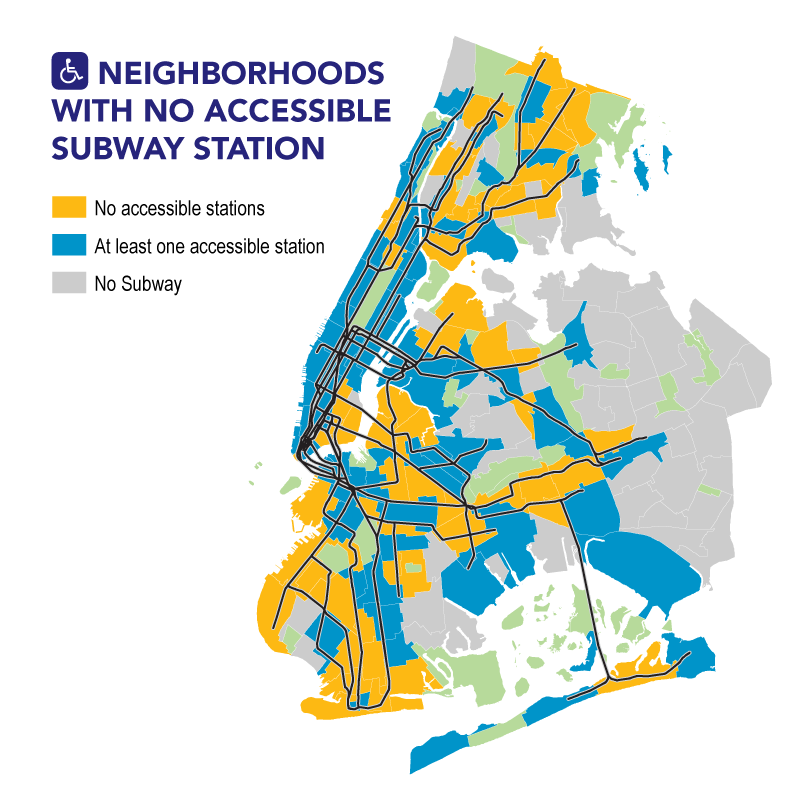

```{r setup, include=FALSE}
knitr::opts_chunk$set(echo = TRUE, warning=FALSE, message=FALSE)
```


# Introduction

Due to the length of the project, I've broken it up into multiple sections and used tabs to condense down some of the less exciting or more repetitive sections. The tabs are meant to be navigated in order, but some, such as parts of Section 4, can be skipped without missing much.


## Background

The initial inspiration for this work was the Data for Democracy NYC Accessibility project ([Project GitHub Repo](https://github.com/Data4Democracy/nyc-accessibility)), which focused on exploring the lack of ADA-accessible stations in the New York City subway system. For those that are unfamiliar, ADA-accessible subway stations are those that comply with the Americans with Disabilities Act of 1990. Among other requirements, they must be designed such that an individual using a wheelchair or other mobility device can get from street level to the turnstiles and onto the train. 

New York City's subway system is one of the busiest in the world, with a weekday average ridership of 5.6 million as of 2017, but it is also the [least accessible transit system in the United States](https://www.nytimes.com/2017/04/25/nyregion/new-york-subway-disability-lawsuit.html). While the ADA focuses on individuals with disabilities, an ADA-compliant system is friendlier to all, from parents with young children and strollers to the elderly. An excuse for the state of things might be the age of the system since the NYC subway is among one of the older ones in the country. However, other mass transit systems that opened around the same time, such as the ones in Boston and Chicago, have a far higher percentage of compliant stations.

The accessibility problem is a symptom of the larger set of issues that have plagued the city's transit system for years now. The subways are slow and overcrowded, the trains manage to be on time only 65% of the time (although this has increased to [70% as of December 2018](https://www.bloomberg.com/news/articles/2018-12-17/nyc-subway-chief-warns-of-death-spiral-without-40-billion-fix)), and the whole of the MTA, the body responsible for the subway along with other transit systems in the area, has been [financially mismanaged](https://www.nytimes.com/2017/11/18/nyregion/new-york-subway-system-failure-delays.html) to the [brink of ruin](https://www.theguardian.com/us-news/2018/nov/20/new-york-city-subway-bus-death-spiral-mta-fares). As an example of said mismanagement, the MTA invested in its bus system and Access-a-Ride, a door-to-door service, in an effort to increase accessibility instead of converting subway stations. But, not only is a system of buses not comparable in terms of speed and service quality to the subway, [this decision wound up costing the MTA more money than it would have to retrofit elevators in subway stations ](https://ny.curbed.com/2017/9/21/16315042/nyc-subway-wheelchair-accessible-ada). As of today, plans are underway to fix the centuries-old signal systems, increase train speeds, and to install elevators at existing stations to make them accessible. But given the previous track record, there is cause for concern about whether the NYC subway system can turn things around, or maybe [Elon Musk will save the day in the end](https://ny.curbed.com/2018/12/10/18134373/nyc-subway-speed-limit-changes). 


## Project goals

### Goals

The Office of NYC Comptroller released [a report in July of 2018](https://comptroller.nyc.gov/reports/service-denied-accessibility-and-the-new-york-city-subway-system/) on the state of accessibility in the NYC subway system. It included a geospatial analysis of NYC neighborhoods and subway station locations, as well as the potential financial impact of subway inaccessibility on the individuals living in those neighborhoods.

I will aim to recreate the map below that was featured in the report, which differentiates neighborhoods based on whether their boundaries contain at least one ADA-accessible station, at least one subway station but no ADA-accessible stations, or no subway station at all.



In addition, I will go further to address what I see as some of the problems with the report.


### Problems with report and potential solutions

Problem 1: NYC neighborhoods are areas that people can quickly identify with, but they can be enormous in terms of geographic area and may not give an accurate picture of accessibility.

Proposed solution: Use the 2010 Census tracts instead, which are smaller in area than neighborhoods, allowing for a more fine-grained analysis.

Problem 2: The report counts stations that are only within the boundaries of a neighboorhood. This strategy is limiting and may be an inaccurate representation of accessibility if, for example, the station is located on the edge of a large neighborhood.

Proposed solution: Use buffer analysis to consider stations only within a certain radius of a geographical point, such as the center of the census tracts.

Problem 3: Report focuses on the presence/absence of a subway station, but does not consider how many stations are in the vicinity.

Proposed solution: Count unique route station stops, including the total number of stations and ADA-accessible stations, within a given geographical area.


## Project focus

I had been curious about geospatial analysis for a while, and this project was a great excuse to learn more. However, this project also turned out to require quite a lot of data cleaning, especially for the Subway Entrances and Exits dataset.

In the end, the main data science-related skills that are the focus of this project are:

* Data exploration and cleaning - I had severely underestimated how messy and out of date the NYC Subway Entrances and Exits dataset was. It needed quite a lot of manual curation to reach an analysis-ready state.
* Geospatial analysis in R - mapping, spatial joins, converting non-spatial data into a spatial format, and more, mainly with the help of the [sf package](https://cran.r-project.org/web/packages/sf/index.html). As an aside, this [DataCamp course on the sf package, led by Zev Ross](https://www.datacamp.com/courses/spatial-analysis-in-r-with-sf-and-raster), was immensely helpful in this regard.


# Setup {.tabset .tabset-fade .tabset-pills}

## Packages

Packages used:

* tidyverse - omnibus package for data import, wrangling, and cleaning (never leave home without it)
* sf - for geospatial data analysis
* ggthemes - ggplot2 theme and palette add-on
* mapview - easy to use package for creating quick interactive maps

```{r packages, comment=NA}
library(tidyverse)
library(sf)
library(ggthemes)
library(mapview)
# minimal theme for nice plots throughout the project
theme_set(theme_minimal())
```


## Data

Shapefiles, imported using the `st_read` function from the `sf` package:

* `nyc.census.map`: Shapefile of NYC 2010 census tract boundaries
* `nyc.neigh.map`: Shapefile of NYC neighborhoods

Datasets, in `.csv` format:

* `subway.ent.exit`: The Subway Entrances and Exits dataset that provides information about what train routes stop at each station, whether the stations are ADA-accessible or not, as well as the station latitude and longitude coordinates, but in a non-spatial format with no coordinate reference system (CRS).   
* `subway.by.line`: In NYC, the subway routes are grouped into "trunk lines", typically based on their route through Manhattan, and the grouping can indicate which trains share many of the same station stops. Each trunk line also has its own distinct assigned color that appears on the subway route symbols. This dataset lists the routes that belong to each trunk line and their respective color codes.
* `num.stat.by.rt.wiki`: This is a list of the number of station stops by route, according to their Wikipedia pages. The data will be used later to clean the subway entrances and exits dataset. NYC subway service changes over the course of the day and the weekend, with some lines switching from express to local or going out of service altogether. In this analysis, I will be focusing on the weekday rush-hour service because, in theory, that is when the most number of people should be using the subway. 


```{r data_import, comment=NA}
### shapefiles ###
nyc.census.map <- st_read("./data/nyct2010_18a/nyct2010.shp")
nyc.neigh.map <- st_read("./data/nynta_18d/nynta.shp")
### subway info ###
subway.ent.exit <- read_csv("./data/2018_update/NYC_Transit_Subway_Entrance_And_Exit_Data.csv")
subway.by.line <- read_csv("./data/2018_update/nyc_subway_stations_grouped.csv")
num.stat.by.rt.wiki <- read_csv("./data/2018_update/nyc_subway_num_stat_by_line.csv")
```


Data sources: 

* NYC Census Map shapefile: [NYC Department of City Planning Open Data Website](https://www1.nyc.gov/site/planning/data-maps/open-data/districts-download-metadata.page)
* NYC Neighborhood Tabulation Areas Map shapefile: [NYC Department of City Planning Open Data Website](https://www1.nyc.gov/site/planning/data-maps/open-data/dwn-nynta.page)
* Subway Entrances and Exits: [Open Data NY](https://data.ny.gov/Transportation/NYC-Transit-Subway-Entrance-And-Exit-Data/i9wp-a4ja)
* Subway by Line Info: Copied from the [NYC Subway Wikipedia Page, Nomenclature section](https://en.wikipedia.org/wiki/New_York_City_Subway)
* Number of Subway Stations by Route: Manually collected from each individual subway route page, such as this page for [the E subway service](https://en.wikipedia.org/wiki/New_York_City_Subway)


## Data preview

The NYC census tract and neighborhood `sf` files can be visualized in many ways, including with the `ggplot2` package and the `plot` function. Here, `ggplot` is used to layer the census tracts in blue and the neighborhood boundaries in orange to demonstrate the difference, for those not familiar with the city. 

```{r nyc_maps_plot, comment=NA}
# nyc census tracts map in blue
nyc.census.map %>% 
  ggplot() +
  geom_sf(color = "#1F77B4") +
  # nyc neighborhoods outlines overlaid in orange
  geom_sf(data = nyc.neigh.map, color = "#FF7F0E", size = 1, fill = NA) +
  ggtitle("NYC census tracts and neighborhoods") +
  xlab("Longitude") +
  ylab("Latitude")
```


Most neighborhoods contain multiple census tracts, except for parks and airports, and each census tract is part of only one neighborhood. Both shapefiles include Staten Island, for which there is no data in the subway entrances/exits dataset, and therefore it will be removed from further consideration.

On top of being spatial objects, a handy feature of the `sf` format is that these objects are also data frames and can be treated as such for filtering, joining, and other data wrangling manipulations.

```{r census_map_summary, comment=NA}
summary(nyc.census.map)
```


For example, as demonstrated above, the `nyc.census.map` object includes the tract codes, the city borough name that the census tract belongs to, as well as the spatial geometry.

As for the other datasets, the Subway Entrances and Exits dataset contains the most useful and relevant information for this project. However, it will require considerable transformation to get it into a usable format, and will have to be given a CRS and converted into a spatial `sf` object at some point.

```{r raw_dataset_glimpse, comment=NA}
# subway entrances/exit data:
glimpse(subway.ent.exit)
# subway route groupings and color codes:
glimpse(subway.by.line)
# number of station stops by route:
glimpse(num.stat.by.rt.wiki)
```


Let's start with the following:

* Remove Staten Island from the maps since the subway datasets do not include Staten Island transit routes
* `subway.ent.exit`: The entrances and exits dataset is very messy. It needs cleaning, and the route columns need to be reorganized into a tidy format. Will also need to evaluate how useful some of the other columns that relate to the specific entrances and exits might be.
* `subway.by.line`: Needs to be tidied, with each subway route on its own row.
* `num.stat.by.rt.wiki`: Is fine as is.


# Preliminary exploration and cleaning

## First cleaning

To start off with the maps, Staten Island will be filtered out and the column names will be converted to lowercase for later convenience.

```{r nyc_map_edit, comment=NA}
nyc.census.4boro <- nyc.census.map %>%  
  filter(BoroName != "Staten Island") %>% 
  `colnames<-`(str_to_lower(colnames(nyc.census.map)))
nyc.neigh.4boro <- nyc.neigh.map %>% 
  filter(BoroName != "Staten Island") %>% 
  `colnames<-`(str_to_lower(colnames(nyc.neigh.map)))
# new column names:
colnames(nyc.census.4boro)
colnames(nyc.neigh.4boro)
# new map (neighborhoods only): 
ggplot(nyc.neigh.4boro) +
  geom_sf(aes(fill = boroname), color = "white") +
  ggtitle("NYC neighborhoods\n(No Staten Island)") +
  xlab("Longitude") +
  ylab("Latitude") +
  # tableau palette from ggthemes, ordered to match later plots
  scale_fill_manual(values = c("#76B7B2", "#F28E2B","#4E79A7", "#E15759"), name = "Borough") +
  # prevent overlapping text on x-axis:
  theme(axis.text.x = element_text(angle = 45, hjust = 1))
```


The column names of the other two subway datasets that needed cleaning will be modified by converting them to lowercase and by replacing the empty spaces to make them easier to work with.

```{r df_colnames_edit, comment=NA}
colnames(subway.ent.exit) <- colnames(subway.ent.exit) %>% 
  str_to_lower() %>% 
  str_replace_all(" ", "_")
colnames(subway.by.line) <- colnames(subway.by.line) %>% 
  str_to_lower() %>% 
  str_replace_all(" ", "_")
# result:
colnames(subway.ent.exit)
colnames(subway.by.line)
```


Much better! 

Next, the `lines` column in the `subway.by.line` dataset needs to be separated and wrangled so that each subway line is its own row. 

```{r sub_line_tidy, comment=NA}
sub.line.tidy <- subway.by.line %>% 
  # converts lines into a list conlumn
  transform(lines = strsplit(lines, "_")) %>%
  # unnests the list column and converts each into a separate row
  unnest(lines) %>% 
  # rename to match other df
  rename(route_name = lines)
# result:
head(sub.line.tidy)
```


Now that that dataset is clean, it is possible to check the route names against the entrances/exits data in order to determine if there is anything odd.

```{r route_name_diff, comment=NA}
subway.ent.exit %>% 
  # gather the unique route names across all of the route columns in the subway ent/exit dataset:
  select(route1:route11) %>% 
  gather("route_num", "route_name") %>% 
  filter(!(is.na(route_name))) %>% 
  select(-route_num) %>% 
  distinct() %>% 
  # any route names in the ent/exit df that are not in the official subway route list on the wiki?
  anti_join(sub.line.tidy, by = "route_name")
```


Yes, it looks like there are four routes in the subway entrance/exit data that are not on the Wikipedia route list. However, the `e` is simply a typo that should be capitalized to `E`, which is a real route, and the three routes `GS`, `FS`, and `H` all fall under the umbrella of `S` in the wiki route list. The three are separate, relatively short routes that are designated as shuttles (hence the "S" name). GS is the 42nd St shuttle in Manhattan that only stops in Times Square and Grand Central. FS is the Franklin Avenue shuttle that operates between Franklin Ave and Prospect Park in Brooklyn. Lastly, H is the Rockaways shuttle in Queens. The discrepancy in route names is something to keep in mind for later, but not an error that needs to be fixed.

It is time to switch focus to the dataset that is the core of this project: the subway entrances and exits data. According to Wikipedia, the official city count is that there are 472 individual subway stations in NYC, or 424 if connected stations are counted as a single station. I expect that the raw dataset will be off to some extent because I've already discovered that it has not even been updated with the opening of the Second Avenue Subway in January of 2017 and the changes to Q train service, which added 3 stations in Manhattan. So how many subway stations are there in the data right now?

```{r stat_name_num_check, comment=NA}
# number of unique subway station names:
length(unique(subway.ent.exit$station_name))
```


That is far too few stations, but it's not a surprise given that station names are often reused in NYC. For example, there are five "23rd Street" stations in Manhattan and one in Queens. Therefore, the `station_name` column alone cannot be used as a unique key for the stations in this dataset. 

What are some other options? The subway by line dataset had special codes and names to refer to the trunk line, such as IRT and BMT, which seem to match the `division` and `line` columns in the entrances/exits data. I suspect that the `division`, `line`, and `station_name` columns will give the unique identifier for each station. But how many distinct combinations of those three columns are there?

```{r stat_name_div_check, comment=NA}
# what the columns look like:
subway.ent.exit %>% 
  select(division:station_name) %>% 
  distinct() %>% 
  head()
# count unique division, line, and station_name column combinations:
subway.ent.exit %>% 
  select(division:station_name) %>% 
  distinct() %>% 
  nrow()
```


There are 465 such combinations, which is close to the expected 472 number. Adding in 3 missing new Q train stations brings the number up, but there may be more stations missing from the dataset than I thought.

As an aside, how many station name, latitude, and longitude combinations are there? 

```{r stat_name_lat_long_count, comment=NA}
subway.ent.exit %>% 
  select(station_name, station_latitude:station_longitude) %>% 
  distinct() %>% 
  nrow()
```


The count of the unique station name, latitude, and longitude combinations is more than there are stations, or even division/line/station name combinations, which suggests that the geographical coordinates are not the best choices for a unique key. On further exploration, it turned out that some stations had multiple sets of coordinates. This may be related to the entrances and exits locations, or possibly due to physical connections between stations.

Based on the above, the next steps for the cleanup of the subway entrance/exit dataset are:

* Create a unique station name column by combining the division, line, and station name which will be treated as the unique key column from now on
* Fix the capitalization typo in the route columns
* To fix the issue of the same station having multiple geographical coordinates, take the average of the latitude and longitude for each station and then use these values as the station location coordinates

```{r sub_ext_key_create, comment=NA}
sub.ent.w.key <- subway.ent.exit %>% 
  # convert the 3 columns to lowercase
  mutate_at(vars(division:station_name), str_to_lower) %>% 
  # create a unique key for each station
  unite("stat_name", division:station_name, sep = "_") %>% 
  # capitalize all of the route names (to fix the e issue)
  mutate_at(vars(route1:route11), str_to_upper) 
# result:
head(sub.ent.w.key %>% select(stat_name:station_longitude))
# coordinates fix:
sub.ent.w.key <- sub.ent.w.key %>% 
  # get rid of original coordinates:
  select(-c(station_latitude:station_longitude)) %>% 
  distinct() %>% 
  # join onto average coordinates:
  left_join(
    # get the average lat and average long for each station:
    sub.ent.w.key %>% 
      select(stat_name:station_longitude) %>% 
      distinct() %>% 
      group_by(stat_name) %>% 
      summarize(
        avg_stat_lat = mean(station_latitude),
        avg_stat_long = mean(station_longitude)
        ),
    by = "stat_name"
    )
# resulting number of stations:
length(unique(sub.ent.w.key$stat_name))
# number of unique geographical coordinates:
sub.ent.w.key %>% 
  select(avg_stat_lat:avg_stat_long) %>% 
  distinct() %>% 
  nrow()
```


It looks like some of the subway stations have the same geographical coordinates, which will need to be explored further later on. But first, let's look at the station entrance/exit-related columns in the dataset and determine what, if anything, might be useful for the purposes of this project.


## Entrance analysis

Apart from the subway station location information, the entrances and exits dataset provides information on, well, the entrances and exits. Included are the entrance/exit geographical coordinates, entry type, as well as an ADA rating, in a `TRUE` or `FALSE` format. Do these columns provide any extra insights and are they worth carrying along? 

First, how many of each entrance type are there and what is the relationship between the entrance type and the ADA-accessibility rating of the station?

```{r sub_entrance_tables, comment=NA}
# count each entrance type:
table(sub.ent.w.key$entrance_type)
# count ada ratings:
table(sub.ent.w.key$ada)
```


Stairs are by far the most common entrance/exit type, which is something new learned, but the ADA count by itself doesn't say much. I'm curious if the ADA rating is on a per-station or per-entrance basis?

```{r sub_entrace_per, comment=NA}
sub.ent.w.key %>% 
  group_by(stat_name) %>% 
  summarize(
    # count total number of entrances per station:
    num_entry = n(),
    # ada is TRUE/FALSE - can sum to get number of ada = TRUE per station:
    num_ada = sum(ada),
    # % ada out of total num of entrances, per station:
    percent_ada = num_ada * 100 / num_entry
    ) %>% 
  {table(.$percent_ada)}
```


The result is that the stations are either 0% ADA or 100% ADA, which indicates that the ADA TRUE/FALSE rating is given to the entire station and not to the particular entrance/exit. This suddenly makes the entrances/exits columns a lot less interesting to me, and I will remove them from consideration after a few more plots.

But first, let's ask what the most common entrance/exit types for ADA-accessible and not accessible stations are?

```{r sub_entrance_count_plot, comment=NA}
sub.ent.w.key %>% 
  group_by(entrance_type, ada) %>% 
  count() %>% 
  ggplot(aes(entrance_type, n, fill = ada)) +
  geom_bar(stat = "identity", position = "dodge") +
  xlab("Entrance/Exit type") +
  ylab("Count") +
  scale_fill_tableau(name = "ADA Status") +
  ggtitle("Entrance/Exit count by ADA rating and type")
```


Stairs by far are the most common form of access, and in general, stations that have stair entrances are more often `ADA == FALSE` than not, but the size of the stairs bars dominates the plot. Let's switch perspectives with `position = "fill"` in the `geom_bar` call.

```{r sub_entrances_fill_plot, comment=NA}
sub.ent.w.key %>% 
  group_by(entrance_type, ada) %>% 
  count() %>% 
  ggplot(aes(entrance_type, n, fill = ada)) +
  geom_bar(stat = "identity", position = "fill") +
  xlab("Entrance/Exit type") +
  ylab("Proportion") +
  scale_fill_tableau(name = "ADA Status") +
  ggtitle("Entrance/Exit count by ADA rating and type\n(Bars fill position)")
```


This alternative view shows that "Elevator" entrances tend to be linked to ADA-accessible stations. I tried to search, but I'm not sure what an "Easement" entrance may be. It seems to indicate a private access point, perhaps meant to be used for utility work. Typical accessible routes are elevators and escalators, which can explain why the elevator and escalator `ADA == TRUE` bars are high relative to other entrance types, although I believe an elevator is required for a station to be rated fully ADA-accessible. 


## Removing entrance info and more tidying

Next, the entrance/exit columns will be removed because they are no longer useful to me, and the route columns will be wrangled into a tidy format. In order to replicate the maps in the official report, the route information would also not be needed and could be dropped at this point. However, I'm interested in how many stations are located within particular geographical areas, and so the route columns will be carried along.  The plan, for now, is that I intend to count each individual train route that stops at a station. For example, if three train routes, such as the 4, 5, and 6 trains, all stop at one station, I would like to be able to count each of those, for a total of three, because the more trains stop in a given area, the more "accessible" or reachable by subway that area is and I want to account for that.

With these goals in mind, let's get to tidying.

```{r sub_ent_tidy, comment=NA}
sub.ent.sml <- sub.ent.w.key %>% 
  # select relevant columns, discard all others from this point on
  select(stat_name, avg_stat_lat:avg_stat_long, route1:route11, ada, ada_notes) %>% 
  distinct() %>% 
  # reformat the route columns into a long format
  gather("route_num", "route_name", route1:route11) %>% 
  # get rid of the many NAs in the route column that were there due to the formatting
  filter(!is.na(route_name)) %>% 
  select(-route_num) %>% 
  distinct()
# new format dimensions:
dim(sub.ent.sml)
head(sub.ent.sml)
# number of unique stations and train route combinations:
sub.ent.sml %>% 
  select(stat_name, route_name) %>% 
  distinct() %>% 
  nrow()
# missing values check:
sapply(sub.ent.sml, anyNA)
```


At least in terms of formatting, the new subway station data frame is much neater, with each route now in its own row instead of in columns. Along with the ADA rating and station location, I've also carried on the `ada_notes` column which is not `NA` for only a few stations and should be easier to explore now that the dataset of interest is much smaller.


## Trouble ahead

Let's take a look at the `ada_notes` column and the stations for which it is not `NA`.

```{r ada_notes_show, comment=NA}
sub.ent.sml %>% 
  select(stat_name, ada, ada_notes) %>% 
  distinct() %>% 
  filter(!(is.na(ada_notes))) %>% 
  arrange(stat_name, ada)
```


Some observations and next steps: 

* It looks like ADA changes were under construction or in planning at the time that this data was compiled. The associated stations need to be checked, and the ADA-status changed from `FALSE` to `TRUE` if changes were completed.
* A few of the stations are ADA-accessible in only one direction (northbound or southbound). I decided to allow `ADA == TRUE` for the entire station if it was ADA-accessible in at least one direction because it would be challenging to count a station as "half-accessible" to account for this. 
* Even though my earlier analysis suggested that the stations were either completely ADA-accessible or not at all, the notes make it clear that some stations are not fully accessible for all train routes. The Union Square station is rated as ADA-accessible for the L, N, Q, R, and W trains, but not for the Lexington Ave 4, 5, and 6 trains, even though `ADA == TRUE` for the entire station (see: `bmt_broadway_union square` and `bmt_canarsie_union square` with the note `Lex not ADA`). This might be a consequence of the original data formatting, and, because for me it is essential to get the station stops count right, I will need to explore this issue further and correct the ADA rating where appropriate.
* Some stations seem to be listed twice because different trunk line trains stop there. For example, again, Union Square, which is considered one station, is listed as `bmt_broadway_union square` for the N/Q/R/W trunk line and `bmt_canarsie_union square` for the L trunk line. These duplicates will need to be removed for an accurate count of train routes down the line.

After exploring the dataset more, I stumbled onto more problems. Most worrying for my purposes was that it turned out that train route names are repeated for each connected station. Case in point, there is a World Trade Center stop where only the E train should stop. But some subway stations are connected underground by tunnels so that one can transfer from one station to another, and the World Trade Center stop is one such station. If I filter for this station only, where only the E should stop, instead there are 5 trains listed.

```{r ind_world_trade_lookup, comment=NA}
sub.ent.sml %>% 
  filter(stat_name == "ind_8 avenue_world trade center")
```


This is because the World Trade Center stop is connected to the Park Place, where the 2 and 3 trains stop, and Chambers St, where the A and C stop. 

If I select for the Park Place station information, it turns out that all of the trains are repeated at this station as well (and the same is true for Chambers St).

```{r irt_park_place, comment=NA}
sub.ent.sml %>% 
  filter(stat_name == "irt_clark_park place")
```


Thankfully, the ADA rating is separate from the World Trade Center station and is correctly marked as `FALSE` at Park Place. However, the issue is that all of the trains are also listed as stopping at this station, as well as the 1 train even though the 1 route should not follow the 2 and 3 in this part of Manhattan.

I initially thought about using the `division` and `line` columns that went into creating the unique station names to filter the extra trains somehow. Based on the data I got from Wikipedia, the associated “line” names with the IND division, for example, should only be:

```{r ind_line_names, comment=NA}
sub.line.tidy %>% 
  filter(str_detect(primary_trunk_line, "IND")) %>% 
  select(primary_trunk_line) %>% 
  distinct()
```


However, the line names for the same division in the subway entrances/exit data are far more varied.

```{r ind_sub_ent_line_names, comment=NA}
sub.ent.sml %>%
  select(stat_name) %>% 
  distinct() %>% 
  # select only the IND division subway station stops
  filter(str_detect(stat_name, "ind")) %>% 
  # separate out the different name parts again
  separate(stat_name, into = c("division", "line", "station_name"), sep = "_") %>% 
  {table(.$line)}
```


Yes, the 8th Ave, 6th Ave, and Crosstown lines are there (although in a different format), but there are several other line names, likely because the modern subway lines were built up over time and many of the current routes are combinations of the old ones. This suggests that I cannot reliably use the line information, and maybe even the division codes to filter the subway station and train route combinations.

On further exploration, it also seems that the dataset was far more out of date than expected. For example, the G train route is missing station stops between Smith 9th St and Church Ave, where its service was extended along the F route in 2009. The problem is best seen overlaid on a map of the city. I had mentioned earlier that the subway entrances/exits dataset, while it did include geospatial coordinates, did not come with a coordinate reference system (CRS). A CRS is important because it defines the units of the spatial object. Trying to work with two objects with different CRS would be like comparing distances measured in inches to kilometers, it wouldn’t make sense. Based on some research, it seems that the subway location data should have “+init=epsg:4326” as its CRS. For now, I won’t worry about turning the subway data to a spatial object and converting its CRS to match the NYC shapefiles. Instead, I can transform the city shapefiles and take advantage of the ggplot2 system of layers to superimpose the subway data over a map.

```{r g_train_old, comment=NA}
# transform the neighborhood map crs to march the subway entrance/exit data:
nyc.map.4boro.stat.crs <- st_transform(nyc.neigh.4boro, crs = "+init=epsg:4326")
nyc.map.4boro.stat.crs %>% 
  ggplot() +
  # plot the neighborhoods
  geom_sf(fill = NA) +
  # plot the F and G subway lines
  geom_point(
    data = sub.ent.sml %>% 
      filter(route_name == "F" | route_name == "G"),
    aes(avg_stat_long, avg_stat_lat, color = route_name),
    size = 2, 
    alpha = 0.8
    ) +
  xlab("Longitude") +
  ylab("Latitude") +
  scale_color_tableau(name = "Route") +
  ggtitle("G and F train routes (Outdated)") +
  theme(axis.text.x = element_text(angle = 45, hjust = 1))
```


In its current state, the dataset has G service terminating at the Smith-Ninth Streets stop. Luckily, in this case, the missing stations could just be added in by attaching a part of the F train route to the G train.

```{r g_train_f_fix, comment=NA}
# get the slice of F train stations that are missing from the G route: 
sub.ent.sml %>% 
  filter(route_name == "F") %>% 
  arrange(avg_stat_lat) %>% 
  filter(avg_stat_lat > 40.62976 & avg_stat_lat < 40.68030)
# extra station for the connected 4 Av-9 St stations (the stop after Smith-Ninth Streets):
# G train is considered IND - grab that 4th ave station
sub.ent.sml <- sub.ent.sml %>% 
  # create a copy of the F train station stops for this section of track
  bind_rows(
    sub.ent.sml %>% 
      filter(route_name == "F") %>% 
      arrange(avg_stat_lat) %>% 
      filter(avg_stat_lat > 40.63612 & avg_stat_lat < 40.67358 & str_detect(stat_name, "ind")) %>% 
      # change the route name for this section 
      mutate(route_name = "G")
    )
# example at Church Ave
sub.ent.sml %>%
  filter(stat_name == "ind_6 avenue_church av")
# now both the F and G are at Church Ave
# Updated G train route:
nyc.map.4boro.stat.crs %>% 
  ggplot() +
  geom_sf(fill = NA) +
  geom_point(
    data = sub.ent.sml %>% 
      filter(route_name == "F" | route_name == "G"),
    aes(avg_stat_long, avg_stat_lat, color = route_name),
    size = 2, 
    alpha = 0.8
    ) +
  xlab("Longitude") +
  ylab("Latitude") +
  scale_color_tableau(name = "Route") +
  ggtitle("G and F train routes (Updated)") +
  theme(axis.text.x = element_text(angle = 45, hjust = 1))
```


The updated route start and end stations are correct, but now there are more stations than expected based on the Wikipedia station count.

```{r g_train_count_prob, comment=NA}
# expected number:
num.stat.by.rt.wiki %>% 
  filter(route_name == "G")
# new number of G train stations:
sub.ent.sml %>%
  filter(route_name == "G") %>% 
  nrow()
```


At this point, I'm starting to think that I'll need to check through the station and train associations manually, but first I will go back to the `ada_notes` issues, deal with those, and drop the column before moving on.


## ADA fixes and hitting a wall

Changes to make based on the `ada_notes`:

* ind_8 avenue_50th st / TRUE / Southbound Only: Leave as ada = TRUE (no changes)
* ind_8 avenue_world trade center / TRUE / Construction: ada = TRUE for E only 
* ind_archer av_sutphin blvd-archer av - jfk / TRUE / Check: ada = TRUE according to wikipedia page (no change)
* bmt_broadway_49th st / TRUE / Northbound Only: Leave as ada = TRUE (no change)
* bmt_broadway_times square-42nd st / TRUE / Shuttle not ADA: set S to ada = FALSE
* bmt_broadway_union square / TRUE / Lex not ADA: set 4/5/6 to ada = FALSE   
* bmt_canarsie_union square / TRUE / Lex not ADA: same as above      
* ind_concourse_kingsbridge rd / FALSE / in planning: switch to TRUE because it has been completed      
* irt_lexington_23rd st / FALSE In Planning: switch to TRUE because it has been completed
* irt_lexington_brooklyn bridge-city hall / TRUE / J Z not ADA: set J/Z to ada = FALSE
* irt_lexington_canal st / TRUE / Bway Nass not ADA: Only set 6 ada  = TRUE
* irt_pelham_hunts point av / FALSE / in planning: complete, set ada = TRUE     
* ind_queens boulevard_forest hills-71st av / FALSE / in planning: complete, set ada = TRUE


Another small fix is that I noticed is that there are two redundant routes, GS and S, that refer to the same thing: the grand central shuttle between times square and grand central. The "S" route will be filtered out and the ADA rating for the GS route will be changed to FALSE because it is not ADA-accessible at both Times Square and Grand Central.

I chose to keep each change as a separate mutate call to keep track of the changes, although it is messy.

```{r ada_notes_fix, comment=NA}
sub.ent.ada.updt <- sub.ent.sml %>% 
  # change world trade center station ada
  mutate(ada = ifelse((stat_name == "ind_8 avenue_world trade center" & route_name != "E"), FALSE, ada)) %>% 
  # change times square shuttle ada, filter out extra "S" route
  filter(route_name != "S") %>% 
  mutate(ada = ifelse(route_name == "GS", FALSE, ada)) %>% 
  # change 4/5/6 at union square to ada = FALSE
  mutate(ada = ifelse(
    ((stat_name == "bmt_broadway_union square" | stat_name == "bmt_canarsie_union square") & (route_name == "4" | route_name == "5" | route_name == "6")),
    FALSE, ada
    )) %>% 
  # change kingsbridge rd ada = TRUE
  mutate(ada = ifelse(stat_name == "ind_concourse_kingsbridge rd", TRUE, ada)) %>% 
  # change Lex / 23rd St stop to TRUE
  mutate(ada = ifelse(stat_name == "irt_lexington_23rd st", TRUE, ada)) %>% 
  # change J/Z at Brooklyn Bridge / City Hall to ada = FALSE
  mutate(ada = ifelse(
    (stat_name == "irt_lexington_brooklyn bridge-city hall" & (route_name == "J" | route_name == "Z")),
    FALSE, ada
    )) %>% 
  # change irt_lexington_canal st to ada = TRUE for 6 train only
  mutate(ada = ifelse(
    (stat_name == "irt_lexington_canal st" & route_name != "6"), FALSE, ada
    )) %>% 
  # change rt 6 hunts point av to ada = TRUE
  mutate(ada = ifelse(stat_name == "irt_pelham_hunts point av", TRUE, ada)) %>% 
  # convert the forst hills / 71st ave station to ada = TRUE for all lines
  mutate(ada = ifelse(stat_name == "ind_queens boulevard_forest hills-71st av", TRUE, ada)) %>% 
  # can get rid of the ada_notes column now
  select(-ada_notes) %>% 
  distinct()
# original length:
dim(sub.ent.sml)
# updated version slightly smaller:
dim(sub.ent.ada.updt)
# original S route:
sub.ent.sml %>% 
  filter(route_name == "S")
# Now S route is gone:
sub.ent.ada.updt %>% 
  filter(route_name == "S")
# GS still there, but has duplicate stops:
sub.ent.ada.updt %>% 
  filter(route_name == "GS")
```


Got rid of a few rows by eliminating the redundant S route, and removed the `ada_notes` column. 

Now back to the earlier issue of trains being assigned to subway stations that they do not stop at and all the previous problems brought up earlier.

How does the number of stations in the subway entrances/exit dataset per route compare to the expected number (according to Wikipedia)?

```{r sub_ent_stat_count, comment= NA}
stat.count.join <- sub.ent.ada.updt %>% 
  group_by(route_name) %>% 
  count() %>% 
  full_join(num.stat.by.rt.wiki, by = "route_name") %>% 
  # W exits in the wiki df, but not in the sub ent/exit df
  filter(route_name != "W")
stat.count.join %>% 
  ggplot(aes(num_stations_norm, n)) +
  # equality line for refence:
  geom_abline(intercept = 0, slope = 1, size = 1, linetype = "dashed") +
  geom_point(size = 2, alpha = 0.8) +
  xlab("Expected station count by route") +
  ylab("Actual station count by route")
stat.count.join %>% 
  filter(num_stations_norm == n)
```


Nearly all of the trains, except for the H shuttle route, have more subway stations assigned to them than expected. The extra stations are not accounted for by different service patterns (such as local late-night service). Based on what was seen earlier from the data, the likely sources of the issues are:


* Stations are duplicated if different division and trunk line trains service it, and all of the routes that stop at the station are listed for each instance of that station in the dataset.
* The dataset is outdated - no updates were made as service changed over the years or when construction projects were completed.
* Separate stations connected by underground tunnels were listed as one station, with all routes servicing both stations (e.g., the E train and the World Trade Center, Park Place, and Chambers St stations situation).

At this point, the options, as I saw them, were: 

Solution 1: Import [a dataset form the NYC Open Data website with updated subway route data](https://data.cityofnewyork.us/Transportation/Subway-Stations/arq3-7z49) and try to merge the ADA data with the new station information.

Problems with Solution 1: Subway station names repeat, which means that a lot of manual data cleaning and validation would still be required to make sure the stations merged correctly. Also, if the subway route information is out of date, likely the ADA status of stations would also need updating (this assumption turns out to be correct in the end). 

Solution 2: Manually go through each route using official NYC subway station listings to make sure that the information is accurate and to remove station duplicates.

Problems with Solution 2: Will require a lot of tedious manual work, and there's always the risk of making mistakes. Will have to manually add-in new 2nd Ave Q-train stations, if not more.


# Manual data cleaning {.tabset .tabset-fade .tabset-pills}

## Reasoning and Resources

I chose Solution 2 because both approaches would require manual validation and this way would get it over with. However, going through line by line turned out to be less tedious than I expected because routes in the same primary trunk line tended to need similar corrections (removing duplicate stations, for example). Also, most of the subway stations were accurately labeled according to the primary trunk line 3-letter code (IRT, IND, and so on), which helped thin out the list of stops. The manual cleanup was not very pretty, but it got the job done.

These tools helped quite a bit in the process:


* [NYC Subway Map](http://web.mta.info/maps/submap.html)
* [Route lists (G train example)](http://web.mta.info/nyct/service/gline.htm)

Disclaimer: Subway service routes can be very different at regular, rush-hour, late-night, and weekend times. For sanity, I based the route/station assignments to meet the regular Wikipedia station stop counts for most lines, and on the routes on the MTA website list. However, service patterns weren't clear to me for some of the trains, so apologies for any errors.


## By lowest number of stations

Starting slow, with the shuttle routes:


### Shuttles

```{r shuttle_corr, comment=NA}
### GS (Manhattan)
num.stat.by.rt.wiki %>% 
  filter(route_name == "GS")
sub.ent.ada.updt %>% 
  filter(route_name == "GS") %>% 
  arrange(stat_name)
# GS has 2 stations for each of its stops, keep only the "42nd st shuttle" stops:
sub.stat.num.updt <- sub.ent.ada.updt %>% 
  filter(!(route_name == "GS" & (str_detect(stat_name, "flushing") | str_detect(stat_name, "lexington"))))
### FS (Brooklyn)
# goal count:
num.stat.by.rt.wiki %>% 
  filter(route_name == "FS")
# actual count:
stat.count.join %>% 
  filter(route_name == "FS") %>% 
  select(route_name:n)
sub.stat.num.updt %>% 
  filter(route_name == "FS") %>% 
  arrange(avg_stat_lat)
# problem: 3 franklin ave stations, when there should only be one
# solution: remove the ind and irt stations - those are the extras
sub.stat.num.updt <- sub.stat.num.updt %>% 
  filter(!(route_name == "FS" & (str_detect(stat_name, "irt") | str_detect(stat_name, "ind"))))
sub.stat.num.updt %>% 
  filter(route_name == "FS")
```


Next, based on lowest number of stops:

```{r after_shuttle, comment=NA}
sub.stat.num.updt %>% 
  group_by(route_name) %>% 
  count() %>% 
  ungroup() %>% 
  inner_join(num.stat.by.rt.wiki, by = "route_name") %>% 
  filter(n != num_stations_norm) %>% 
  filter(num_stations_norm == min(num_stations_norm))
```


The G and Z trains, both with 21 stations each, are next. I had initially wondered if maybe there are duplicates based on station lat/long pairs, and if I could get away with using the unique coordinates:

```{r G_check, comment=NA}
sub.line.tidy %>% 
  filter(route_name == "G")
sub.stat.num.updt %>% 
  filter(route_name == "G") %>% 
  select(avg_stat_lat, avg_stat_long) %>% 
  distinct() %>% 
  nrow()
```


Unfortunately, that did not turn out to be the case. From here, I manually checked through each route station stop list, comparing them to the official list on each train's webpage.


### G train

Goal number of G train stations: 21

```{r G_train_corr, comment=NA}
sub.stat.num.updt <- sub.stat.num.updt %>%
  filter(route_name != "G") %>% 
  bind_rows(
    sub.stat.num.updt %>% 
      filter(route_name == "G" & str_detect(stat_name, "ind") & stat_name != "ind_queens boulevard_23rd st-ely av")
    )
# Check:
sub.stat.num.updt %>% 
  filter(route_name == "G") %>% 
  nrow()
```


### Z train

Goal number of Z train stations: 21

```{r Z_train_corr, comment=NA}
# division info and trunk line:
sub.line.tidy %>% 
  filter(route_name == "Z")
sub.stat.num.updt <- sub.stat.num.updt %>% 
  filter(route_name != "Z") %>% 
  bind_rows(
    sub.stat.num.updt %>% 
      filter(route_name == "Z" & str_detect(stat_name, "bmt") & stat_name != "bmt_broadway_canal st (ul)") %>% 
      # add Z train to the broadway junction stop in Queens (was A/C/J/L)
      bind_rows(
        sub.stat.num.updt %>% 
          filter(str_detect(stat_name, "broadway junction")) %>% 
          mutate(route_name = "Z") %>% 
          distinct()
        ) %>% 
      # add Z train to the Alabama Ave stop in Queens (was J only)
      bind_rows(
        sub.stat.num.updt %>% 
          filter(str_detect(stat_name, "alabama")) %>% 
          mutate(route_name = "Z")
      ) %>% 
      # add back in the jamaica center and jfk airport stops that were filtered out earlier based on the "bmt" filter
      bind_rows(
        sub.stat.num.updt %>% 
          filter(route_name == "Z" & avg_stat_long > -73.82829)
        )
    )
# Check:
sub.stat.num.updt %>% 
  filter(route_name == "Z") %>% 
  nrow()
```


The station count for Z is now correct, next:

```{r after_z_and_g, comment=NA}
sub.stat.num.updt %>% 
  group_by(route_name) %>% 
  count() %>% 
  ungroup() %>% 
  inner_join(num.stat.by.rt.wiki, by = "route_name") %>% 
  filter(n != num_stations_norm) %>% 
  filter(num_stations_norm == min(num_stations_norm))
```


### 7 train

Goal number of 7 train stations: 22

```{r 7_train_corr, comment=NA}
# division and trunk line:
sub.line.tidy %>% 
  filter(route_name == "7")
sub.stat.num.updt <-  sub.stat.num.updt %>%
  filter(route_name != "7") %>% 
  bind_rows(
    sub.stat.num.updt %>% 
      filter(route_name == "7" & str_detect(stat_name, "irt")) %>% 
      # eliminate station copies at times square and grand central
      filter(!(
        stat_name %in% c(
          "irt_42nd st shuttle_times square", "irt_42nd st shuttle_grand central",
          "irt_lexington_grand central-42nd st"
          )
        )) %>% 
      # convert ADA = TRUE at the court sq station (was incorrectly FALSE)
      mutate(ada = ifelse(stat_name == "irt_flushing_45 rd-court house sq", TRUE, ada))
    )
# Check:
sub.stat.num.updt %>% 
  filter(route_name == "7") %>% 
  nrow()
```


### E train

Goal number of E train stations: 22

```{r E_train_corr, comment=NA}
sub.line.tidy %>% 
  filter(route_name == "E")
sub.stat.num.updt <- sub.stat.num.updt %>% 
  filter(route_name != "E") %>% 
  bind_rows(
    sub.stat.num.updt %>% 
      filter(route_name == "E" & str_detect(stat_name, "ind") &  stat_name != "ind_8 avenue_chambers st") %>% 
      # ADA fix
      mutate(ada = ifelse(stat_name == "ind_archer av_jamaica-van wyck", TRUE, ada)) %>% 
      # E train to Briarwood station
      bind_rows(
        sub.stat.num.updt %>% 
          filter(str_detect(stat_name, "briarwood")) %>% 
          mutate(route_name = "E")
        )
    )
# Check:
sub.stat.num.updt %>% 
  filter(route_name == "E") %>% 
  nrow()
```


Next:

```{r after_E, comment=NA}
sub.stat.num.updt %>% 
  group_by(route_name) %>% 
  count() %>% 
  ungroup() %>% 
  inner_join(num.stat.by.rt.wiki, by = "route_name") %>% 
  filter(n != num_stations_norm) %>% 
  filter(num_stations_norm == min(num_stations_norm))
```


### L train

Goal number of L train stations: 24

```{r L_train_corr, comment=NA}
# L division and line:
sub.line.tidy %>% 
  filter(route_name == "L")
sub.stat.num.updt <-  sub.stat.num.updt %>% 
  filter(route_name != "L") %>% 
  bind_rows(
    sub.stat.num.updt %>% 
      # remove extra stations
      filter(route_name == "L" & str_detect(stat_name, "bmt") & stat_name != "bmt_broadway_union square") %>% 
      # correct ADA status
      mutate(ada = ifelse(stat_name == "bmt_canarsie_wilson av", TRUE, ada)) %>% 
      # add L train to broadway junction
      bind_rows(
        sub.stat.num.updt %>% 
          filter(str_detect(stat_name, "broadway junction") & route_name == "L")
        )
    )
# Check:
sub.stat.num.updt %>% 
  filter(route_name == "L") %>% 
  nrow()
```


Next:

```{r after_L, comment=NA}
sub.stat.num.updt %>% 
  group_by(route_name) %>% 
  count() %>% 
  ungroup() %>% 
  inner_join(num.stat.by.rt.wiki, by = "route_name") %>% 
  filter(n != num_stations_norm) %>% 
  filter(num_stations_norm == min(num_stations_norm))
```


### B train

The B train is a little unusual in that it makes more stops during rush hour, which is reflected in the number of "limited" service stations.

Goal number of B train stations: 37

```{r b_train_corr, comment=NA}
sub.line.tidy %>% 
  filter(route_name == "B")
sub.stat.num.updt <- sub.stat.num.updt %>% 
  filter(route_name != "B") %>% 
  bind_rows(
    sub.stat.num.updt %>% 
      filter(route_name == "B" & (str_detect(stat_name, "bmt") | str_detect(stat_name, "ind"))) %>% 
      # convert non-ada stations to those that are ada = TRUE now
      mutate(ada = ifelse(
        stat_name %in% c(
          "bmt_brighton_kings highway", "ind_6 avenue_broadway-lafayette st", "ind_8 avenue_125th st"
          ),
        TRUE, ada)) %>% 
      # stations to exclude: 
      # atlantic ave /barclays duplicates and stops between barclays and brighton where B does not stop
      filter(!(avg_stat_lat > 40.60867 & avg_stat_lat < 40.63508)) %>% 
      filter(!(
        stat_name %in% c(
          "bmt_broadway_34th st", "bmt_brighton_parkside av", 
          "bmt_4 avenue_pacific st", "bmt_brighton_atlantic av", 
          "bmt_brighton_av u", "bmt_brighton_neck rd", 
          "bmt_brighton_beverly rd", "bmt_brighton_cortelyou rd"
          )
        ))
    )
# Check:
sub.stat.num.updt %>% 
  filter(route_name == "B") %>% 
  nrow()
```


Next:

```{r after_B, comment=NA}
sub.stat.num.updt %>% 
  group_by(route_name) %>% 
  count() %>% 
  ungroup() %>% 
  inner_join(num.stat.by.rt.wiki, by = "route_name") %>% 
  filter(n != num_stations_norm & route_name != "B") %>%
  filter(num_stations_norm == min(num_stations_norm))
```


### 4 train

Goal number of 4 train stations: 28 (need to exclude late night service)

```{r 4_train_corr, comment=NA}
sub.stat.num.updt <- sub.stat.num.updt %>% 
  filter(route_name != "4") %>% 
  bind_rows(
    sub.stat.num.updt %>% 
      filter(route_name == "4" & str_detect(stat_name, "irt")) %>% 
      filter(!(
        stat_name %in% c(
          "irt_flushing_grand central-42nd st", "irt_42nd st shuttle_grand central", 
          "irt_clark_fulton st", "irt_clark_borough hall"
          )
        )) %>% 
      mutate(ada = ifelse(stat_name == "irt_lexington_fulton st", TRUE, ada))
    )
# Check:
sub.stat.num.updt %>% 
  filter(route_name == "4") %>% 
  nrow()
```


## By primary trunk line

After going through one or two routes per trunk line, I realized that the other train routes along that line would have similar problems, so it would be easier to go by trunk line group, starting with the trains that have already been modified.


### J train

Goal number of J train stations: 30

```{r J_train_corr, comment=NA}
sub.stat.num.updt <- sub.stat.num.updt %>% 
  filter(route_name != "J") %>% 
  bind_rows(
    sub.stat.num.updt %>% 
      filter(route_name == "J" & str_detect(stat_name, "bmt") & stat_name != "bmt_broadway_canal st (ul)") %>%
      # add back in jamaica center and the jfk airport stop
      bind_rows(
        sub.stat.num.updt %>% 
          filter(route_name == "J" & avg_stat_long > -73.82829)
      ) %>%
      # add J train to broadway junction
      bind_rows(
        sub.stat.num.updt %>% 
          filter(str_detect(stat_name, "broadway junction") & route_name == "J")
      ) %>% 
      mutate(ada = ifelse(stat_name == "bmt_nassau_fulton st", TRUE, ada))
    )
# Check:
sub.stat.num.updt %>% 
  filter(route_name == "J") %>% 
  nrow()
```


What's left?

```{r after_J, comment=NA}
sub.stat.num.updt %>% 
  group_by(route_name) %>% 
  count() %>% 
  ungroup() %>% 
  inner_join(num.stat.by.rt.wiki, by = "route_name") %>% 
  filter(n != num_stations_norm & route_name != "B")
```


Will leave N/Q/R/W for last, but let's get into the A/C lines since the E was already visited.


### A train

Goal number of A train stations: 44

```{r A_train_corr, comment=NA}
sub.stat.num.updt <- sub.stat.num.updt %>% 
  filter(route_name != "A") %>% 
  bind_rows(
    sub.stat.num.updt %>% 
      filter(route_name == "A" & str_detect(stat_name, "ind")) %>%
      # remove stations where the A does not stop
      filter(!(
        stat_name %in% c(
          "ind_8 avenue_world trade center", "ind_8 avenue_broadway-nassau", 
          "ind_fulton_franklin av", "ind_fulton_kingston-throop",
          "ind_fulton_ralph av", "ind_fulton_rockaway av",
          "ind_fulton_liberty av", "ind_fulton_van siclen av", 
          "ind_fulton_shepherd av"
          )
        )) %>% 
      # add in the fulton st stop in manhattan
      bind_rows(
        sub.stat.num.updt %>% 
          filter(str_detect(stat_name, "fulton st") & route_name == "4") %>% 
          mutate(route_name = "A")
      ) %>% 
      # ada fixes
      mutate(ada = ifelse(
        stat_name %in% c(
          "ind_8 avenue_125th st", "ind_rockaway_far rockaway-mott av",
          "ind_rockaway_aqueduct racetrack", "ind_fulton_jay st - borough hall",
          "ind_fulton_utica av", "ind_liberty_lefferts blvd"
          ), 
        TRUE, ada
        )) %>% 
      # add in rockaway beach stops that A makes during rush hour
      bind_rows(
        sub.stat.num.updt %>% 
          filter(route_name == "H" & !(str_detect(stat_name, "broad channel"))) %>% 
          mutate(route_name = "A")
        )
    )
# Check:
sub.stat.num.updt %>% 
  filter(route_name == "A") %>% 
  nrow()
```


### C train

Goal number of C train stations: 40

```{r c_train_corr, comment=NA}
sub.stat.num.updt <- sub.stat.num.updt %>% 
  filter(route_name != "C") %>% 
  bind_rows(
    sub.stat.num.updt %>% 
      filter(route_name == "C" & str_detect(stat_name, "ind")) %>% 
      filter(!(stat_name %in% c("ind_8 avenue_broadway-nassau", "ind_8 avenue_world trade center"))) %>% 
      bind_rows(
        sub.stat.num.updt %>% 
          filter(str_detect(stat_name, "fulton st") & route_name == "A") %>% 
          mutate(route_name = "C")
        ) %>%
      mutate(ada = ifelse(
        stat_name %in% c("ind_8 avenue_125th st", "ind_fulton_jay st - borough hall", "ind_fulton_utica av"),
        TRUE, ada))
    )
# Check:
sub.stat.num.updt %>% 
  filter(route_name == "C") %>% 
  nrow()
```


### 5 train

Goal number of 5 train stations: 45

```{r 5_train_corr, comment=NA}
sub.stat.num.updt <- sub.stat.num.updt %>% 
  filter(route_name != "5") %>% 
  bind_rows(
    sub.stat.num.updt %>% 
      filter(route_name == "5" & str_detect(stat_name, "irt")) %>% 
      filter(!(
        stat_name %in% c(
          "irt_clark_borough hall", "irt_clark_fulton st", 
          "irt_flushing_grand central-42nd st", "irt_42nd st shuttle_grand central", 
          "irt_white plains road_wakefield-241st st"
          )
        )) %>%
      mutate(ada = ifelse(
        stat_name %in% c(
          "irt_lexington_fulton st", "irt_white plains road_east 180th st",
          "irt_white plains road_gun hill rd"
          ),
        TRUE, ada))
    )
# Check
sub.stat.num.updt %>% 
  filter(route_name == "5") %>% 
  nrow()
```


### 6 train

Goal number of 6 train stations: 38

```{r 6_train_corr, comment=NA}
sub.stat.num.updt <- sub.stat.num.updt %>% 
  filter(route_name != "6") %>% 
  bind_rows(
    sub.stat.num.updt %>% 
      filter(route_name == "6" & str_detect(stat_name, "irt")) %>% 
      filter(!(stat_name %in% c("irt_flushing_grand central-42nd st", "irt_42nd st shuttle_grand central"))) %>% 
      mutate(ada = ifelse(stat_name %in% c("irt_lexington_bleecker st"), TRUE, ada))
    )
# Check:
sub.stat.num.updt %>% 
  filter(route_name == "6") %>% 
  nrow()
```


What's left?

```{r after_6, comment=NA}
sub.stat.num.updt %>% 
  group_by(route_name) %>% 
  count() %>% 
  ungroup() %>% 
  inner_join(num.stat.by.rt.wiki, by = "route_name") %>% 
  filter(n != num_stations_norm & route_name != "B")
```


D/F/M next.


### D train

Goal number of D train stations: 36

```{r D_train_corr, comment=NA}
sub.stat.num.updt <- sub.stat.num.updt %>% 
  filter(route_name != "D") %>% 
  bind_rows(
    sub.stat.num.updt %>% 
      # the D train stops are a mix of ind and bmt 
      filter(route_name == "D" & (str_detect(stat_name, "ind") | str_detect(stat_name, "bmt"))) %>% 
      filter(!(
        stat_name %in% c(
          "bmt_broadway_34th st", "bmt_4 avenue_pacific st", 
          "bmt_brighton_atlantic av", "bmt_sea beach_new utrecht av", 
          "bmt_brighton_stillwell av")
        )) %>% 
      # add in the brooklyn 36th st stop:
      bind_rows(
        sub.stat.num.updt %>% 
          filter(str_detect(stat_name, "4 avenue_36")) %>% 
          mutate(route_name = "D") %>% 
          distinct()
        ) %>% 
      mutate(ada = ifelse(
        stat_name %in% c("ind_8 avenue_125th st", "ind_6 avenue_broadway-lafayette st", "bmt_west end_bay parkway"),
        TRUE, ada))
    )
# is the number of stations correct now?
sub.stat.num.updt %>% 
  filter(route_name == "D") %>% 
  nrow()
```


### F train

Goal number of F train stations: 45

```{r F_train_corr, comment=NA}
sub.stat.num.updt <- sub.stat.num.updt %>% 
  filter(route_name != "F") %>% 
  bind_rows(
    sub.stat.num.updt %>% 
      filter(route_name == "F" & (str_detect(stat_name, "ind") | str_detect(stat_name, "bmt"))) %>% 
      filter(!(
        stat_name %in% c(
          "bmt_broadway_34th st", "bmt_canarsie_6th av", 
          "bmt_nassau_essex st", "bmt_broadway_lawrence st", 
          "bmt_4 avenue_9th st", "bmt_brighton_stillwell av", 
          "bmt_brighton_west 8th st"
          )
        )) %>% 
      mutate(ada = ifelse(
        stat_name %in% c("ind_6 avenue_broadway-lafayette st", "ind_fulton_jay st - borough hall"),
        TRUE, ada))
    )
# Check:
sub.stat.num.updt %>% 
  filter(route_name == "F") %>% 
  nrow()
```


### M train

Goal number of M train stations: 36

```{r M_train_corr, comment=NA}
sub.stat.num.updt <- sub.stat.num.updt %>% 
  filter(route_name != "M") %>% 
  bind_rows(
    sub.stat.num.updt %>% 
      filter(route_name == "M" & (str_detect(stat_name, "ind") | str_detect(stat_name, "bmt"))) %>% 
      filter(!(stat_name %in% c("bmt_broadway_34th st", "bmt_canarsie_6th av", "bmt_nassau_essex st"))) %>% 
      mutate(ada = ifelse(stat_name %in% c("ind_6 avenue_broadway-lafayette st"), TRUE, ada))
    )
# Check:
sub.stat.num.updt %>% 
  filter(route_name == "M") %>% 
  nrow()
```


What's left?

```{r after_M, comment=NA}
sub.stat.num.updt %>% 
  group_by(route_name) %>% 
  count() %>% 
  ungroup() %>% 
  inner_join(num.stat.by.rt.wiki, by = "route_name") %>% 
  filter(n != num_stations_norm & route_name != "B")
```


1/2/3 next:


### 1 train

Goal number of 1 train stations: 38

```{r 1_train_corr, comment=NA}
sub.stat.num.updt <- sub.stat.num.updt %>% 
  filter(route_name != "1") %>% 
  bind_rows(
    sub.stat.num.updt %>% 
      filter(route_name == "1" & str_detect(stat_name, "irt")) %>%
      filter(!(stat_name %in% c("irt_42nd st shuttle_times square", "irt_clark_park place"))) %>% 
      # add in the re-opened WTC Cortlandt station (doesn't exist in dataset, coord from wikipedia)
      bind_rows(
        tibble(
          stat_name = "irt_broadway-7th ave_wtc cortlandt", ada = TRUE, 
          avg_stat_lat = 40.7115, avg_stat_long = -74.012, route_name = "1")
        ) %>% 
      mutate(ada = ifelse(
        stat_name %in% c("irt_broadway-7th ave_dyckman st", "irt_broadway-7th ave_168th st"),
        TRUE, ada))
    )
# Check:
sub.stat.num.updt %>% 
  filter(route_name == "1") %>% 
  nrow()
```


### 2 train

Goal number of 2 train stations: 49

```{r 2_train_corr, comment=NA}
sub.stat.num.updt <- sub.stat.num.updt %>% 
  filter(route_name != "2") %>% 
  bind_rows(
    sub.stat.num.updt %>% 
      filter(route_name == "2" & str_detect(stat_name, "irt")) %>% 
      filter(!(
        stat_name %in% c(
          "irt_42nd st shuttle_times square", "irt_lexington_fulton st",
          "irt_lexington_borough hall"
          )
        )) %>% 
      mutate(ada = ifelse(
        stat_name %in% c(
          "irt_white plains road_gun hill rd", "irt_white plains road_east 180th st",
          "irt_clark_fulton st"
          ),
        TRUE, ada))
    )
# Check:
sub.stat.num.updt %>% 
  filter(route_name == "2") %>% 
  nrow()
```


### 3 train

Goal number of 3 train stations: 34

```{r 3_train_corr, comment=NA}
sub.stat.num.updt <- sub.stat.num.updt %>% 
  filter(route_name != "3") %>% 
  bind_rows(
    sub.stat.num.updt %>% 
      filter(route_name == "3" & str_detect(stat_name, "irt")) %>% 
      filter(!(
        stat_name %in% c("irt_42nd st shuttle_times square", "irt_lexington_fulton st", "irt_lexington_borough hall")
        )) %>%
      mutate(ada = ifelse(stat_name %in% c("irt_clark_fulton st"), TRUE, ada))
    )
# Check:
sub.stat.num.updt %>% 
  filter(route_name == "3") %>% 
  nrow()
```


What's left?

```{r after_3, comment=NA}
sub.stat.num.updt %>% 
  group_by(route_name) %>% 
  count() %>% 
  ungroup() %>% 
  inner_join(num.stat.by.rt.wiki, by = "route_name") %>% 
  filter(n != num_stations_norm & route_name != "B")
```


Now for the N/Q/R/W route updates that I've been avoiding:


### R train

Goal number of R train stations: 45

```{r R_train_corr, comment=NA}
sub.stat.num.updt <- sub.stat.num.updt %>% 
  filter(route_name != "R") %>% 
  bind_rows(
    sub.stat.num.updt %>% 
      filter(route_name == "R" & (str_detect(stat_name, "bmt") | str_detect(stat_name, "ind"))) %>% 
      filter(!(stat_name %in% c(
        "ind_6 avenue_smith-9th st", "bmt_4 avenue_pacific st", 
        "bmt_brighton_atlantic av", "ind_fulton_jay st - borough hall", 
        "bmt_nassau_canal st", "bmt_canarsie_union square", 
        "ind_6 avenue_34th st", "ind_8 avenue_42nd st"
        ))) %>% 
      mutate(ada = ifelse(stat_name %in% c("bmt_broadway_lawrence st", "bmt_broadway_cortlandt st"), TRUE, ada))
    )
# Check:
sub.stat.num.updt %>% 
  filter(route_name == "R") %>% 
  nrow()
```


### N train

Goal number of N train stations: 32

```{r N_train_corr, comment=NA}
sub.stat.num.updt <- sub.stat.num.updt %>% 
  filter(route_name != "N") %>% 
  bind_rows(
    sub.stat.num.updt %>% 
      filter(route_name == "N" & str_detect(stat_name, "bmt")) %>% 
      filter(!(stat_name %in% c(
        "bmt_brighton_stillwell av", "bmt_west end_62nd st", 
        "bmt_brighton_atlantic av", "bmt_4 avenue_pacific st", 
        "bmt_nassau_canal st", "bmt_canarsie_union square"
        ))) %>% 
      # add back in queensboro plaza, only route that has irt division instead of bmt
      bind_rows(sub.stat.num.updt %>% filter(route_name == "N" & str_detect(stat_name, "queensboro")))
    )
# Check:
sub.stat.num.updt %>% 
  filter(route_name == "N") %>% 
  nrow()
```


### W train

The W train was introduced to replace the Q train in Astoria when the Q was rerouted up 2nd Ave in Manhattan from its original route in Queens. Unsurprisingly, since the subway entrances/exits dataset contains the old Q train route information, the W is also not included. Luckily, the W route is a mashup of the R and N routes, so those route sections can be stitched together to create the W.

Goal number of W train stations: 23

```{r W_train_corr, comment=NA}
sub.stat.num.updt <- sub.stat.num.updt %>% 
  bind_rows(
    sub.stat.num.updt %>% 
      filter(route_name == "N" & avg_stat_lat > 40.68367) %>% 
      bind_rows(
        sub.stat.num.updt %>% 
          filter(route_name == "R") %>% 
          filter(avg_stat_lat > 40.69410 & avg_stat_lat < 40.71952)
        ) %>% 
      mutate(route_name = "W")
    )
# Check:
sub.stat.num.updt %>% 
  filter(route_name == "W") %>% 
  nrow()
```


### Q train

Last, but not least, the Q train update, which included removing the old stations stops in Queens, adding in the 2nd Ave stops that did not exist in the dataset, and removing some station stops in Brooklyn.

Goal number of Q train stations: 29

```{r Q_train_corr, comment=NA}
sub.stat.num.updt <- sub.stat.num.updt %>% 
  filter(route_name != "Q") %>% 
  bind_rows(
    sub.stat.num.updt %>% 
      filter(route_name == "Q" & !str_detect(stat_name, "astoria") & str_detect(stat_name, "bmt")) %>%
      # add in 3 new 2nd Ave stops at 72nd St, 86th St, and 96th St
      bind_rows(
        tibble(
          # assign names to match existing pattern
          stat_name = c("ind_2 avenue_72nd st", "ind_2 avenue_86th st", "ind_2 avenue_96th st"), 
          # all are ADA = TRUE
          ada = rep(TRUE, 3), 
          # lat and long from wikipedia pages for eachs tation
          avg_stat_lat = c(40.768889, 40.777861, 40.7841), 
          avg_stat_long = c(-73.958333, -73.95175, -73.9472),
          # only the Q stops at these stations on a regular schedule
          route_name = rep("Q", 3)
          )
        ) %>% 
      # add in the 63rd St, where only the F used to stop, but now the Q also stops there
      bind_rows(
        sub.stat.num.updt %>% 
          filter(stat_name == "ind_63rd street_lexington av") %>% 
          mutate(route_name = "Q")
      ) %>% 
      filter(!(stat_name %in% c(
        "bmt_broadway_5th av", "bmt_broadway_lexington av", 
        "bmt_broadway_49th st", "bmt_canarsie_union square", 
        "bmt_nassau_canal st", "bmt_4 avenue_pacific st", 
        "bmt_brighton_atlantic av", "bmt_coney island_stillwell av", 
        "bmt_coney island_west 8th st"
        ))) %>%
      mutate(ada = ifelse(stat_name %in% c("bmt_brighton_av h", "bmt_brighton_kings highway"), TRUE, ada))
    )
# Check:
sub.stat.num.updt %>% 
  filter(route_name == "Q") %>% 
  nrow()
sub.stat.num.updt %>% 
  group_by(route_name) %>% 
  count() %>% 
  ungroup() %>% 
  inner_join(num.stat.by.rt.wiki, by = "route_name") %>% 
  filter(n != num_stations_norm & route_name != "B")
```


At last! All of the subway station route counts match.

```{r sub_updt_row_count, comment=NA}
# original station / train route count:
nrow(sub.ent.ada.updt)
# new station / train route count:
nrow(sub.stat.num.updt)
```

The final row count, after removing all of those extra stations, is 750.


# Analysis and Visualization

As a result of the data cleaning process:


* Over 200 duplicate or outdated subway station-train route associations have been removed.
* Some station ADA-accessibility ratings have been updated from `FALSE` to `TRUE`, all of which had no indication that changes were under construction and were not mentioned in the `ada_notes` column that was explored earlier.

Now that the subway station dataset is relatively clean and tidy, it’s possible to finally move on to do some geospatial analysis with it and the NYC shapefiles. Although the station dataset includes the geographical station coordinates, it is not a spatial object in the same sense that the map shapefiles are. Earlier, I had changed the reference system of one of the maps to match the subway data, but here I will turn the entire subway dataset into a sf spatial object for further analysis. Then, the CRS of the new spatial object will be converted to match the NYC map shapefile units.

```{r convert_sub_df_to_sf, comment=NA}
# convert the subway data to a spatial object and assign it the most likely CRS:
sub.sf.nyc.crs <- st_as_sf(sub.stat.num.updt, coords = c("avg_stat_long", "avg_stat_lat"), crs = "+init=epsg:4326")
head(sub.sf.nyc.crs)
# change the CRS to match the map shapefiles:
sub.sf.nyc.crs <- st_transform(sub.sf.nyc.crs, crs = st_crs(nyc.census.4boro))
head(sub.sf.nyc.crs)
```


Note the change in the geometry column after the `st_transform()` call - the subway station stop dataset now has a geometry column in US foot units and can be combined and layered with the map shapefiles for visualization and spatial analysis purposes. 

Here are the station stops visualized over the NYC neighborhoods map, colored according to their traditional service line colors:

```{r sub_line_viz, comment=NA}
nyc.neigh.4boro %>% 
  ggplot() +
  # plot the NYC neighborhoods map
  geom_sf(fill = NA) +
  # layer the station stops:
  geom_sf(
    data = sub.sf.nyc.crs %>% 
      mutate(route_name = ifelse(route_name %in% c("FS", "GS", "H"), "S", route_name)) %>% 
      left_join(sub.line.tidy, by = "route_name"), 
    size = 1.5, aes(color = primary_trunk_line), alpha = 0.8
    ) +
  scale_color_manual(
    # color according to trunk line
    values = c("#fccc0a", "#a7a9ac", "#996633", "#6cbe45", "#2850ad", "#ff6319", "#ee352e", "#b933ad", "#00933c", "#808183"),
    name = "Subway Trunk Line"
    ) +
  xlab("Longitude") +
  ylab("Latitude") +
  ggtitle("NYC subway station stops") +
  theme(axis.text.x = element_text(angle = 45, hjust = 1))
```


## By Route

Let's first look at how many station stops (ADA-accessible or not) are along each train route.

```{r analysis_by_route_prep, comment = NA}
stat.by.route <- sub.stat.num.updt %>% 
  group_by(route_name) %>% 
  summarize(
    # total number of stations by route:
    total_stat = n(),
    # ada is TRUE/FALSE - use this to get total number of ada stations by route:
    num_ada = sum(ada),
    # percent of total num of station stops that are ada, by route:
    per_ada = round(num_ada * 100 / total_stat, 2)
  ) %>% 
  # convert the 3 shuttles into route_name == "S", to match other datasets
  mutate(rt_mod = ifelse(route_name == "GS" | route_name == "FS" | route_name == "H", "S", route_name)) %>% 
  # join to get subway route groupings, colors
  left_join(sub.line.tidy, by = c("rt_mod" = "route_name")) %>% 
  arrange(primary_trunk_line, route_name)
# create factor for nice route order in plots
stat.by.route$rt_order <- factor(stat.by.route$route_name, levels = stat.by.route$route_name)
# rearrange to match up colors with routes:
subway.by.line <- subway.by.line %>% 
  arrange(primary_trunk_line)
```


With the summary data frame prepped, it's time to plot, starting with a bar graph of the total number and the number of ADA-accessible subway station stops by route. The bars will be colored by their traditional NYC subway colors.

```{r stat_by_route_bar, comment=NA}
# average number of subway stations per route
mean(stat.by.route$total_stat)
stat.by.route %>% 
  ggplot(aes(rt_order, total_stat, fill = primary_trunk_line)) +
  geom_bar(stat = "identity") +
  # dashed line for mean number of total stations
  geom_hline(yintercept = mean(stat.by.route$total_stat), linetype = "dashed") +
  scale_fill_manual(values = subway.by.line$hexadecimal, name = "Trunk Line") +
  ylab("Total number of stations") +
  xlab("Subway route") +
  ggtitle("Total number of subway stations per route")
# average number of ada-accessible stations per route:
mean(stat.by.route$num_ada)
stat.by.route %>% 
  ggplot(aes(rt_order, num_ada, fill = primary_trunk_line)) +
  geom_bar(stat = "identity") +
  # dashed line for mean number of accessible stations per route
  geom_hline(yintercept = mean(stat.by.route$num_ada), linetype = "dashed") +
  scale_fill_manual(values = subway.by.line$hexadecimal, name = "Trunk Line") +
  ylab("Number of ADA stations") +
  xlab("Subway route") +
  ggtitle("Number of ADA-accessible subway stations per route")
```


There is an average of 30 stops (of any kind) and 9 ADA-accessible stations per train route; these values are represented by the dashed lines in the plots above. 

The number of ADA-accessible stations per route is far less than the total number of stations, which is not unexpected. Let's take a look at the percent of subway stations that are ADA-accessible per route.

```{r per_ada_by_route_plot, comment=NA}
# average percent accessible statious out of total
round(mean(stat.by.route$per_ada), 2)
stat.by.route %>% 
  ggplot(aes(rt_order, per_ada, fill = primary_trunk_line)) +
  geom_bar(stat = "identity") +
  geom_hline(yintercept = mean(stat.by.route$per_ada), linetype = "dashed") +
  scale_fill_manual(values = subway.by.line$hexadecimal, name = "Trunk Line") +
  ylab("Percent of stations that are ADA") +
  xlab("Subway route") +
  ggtitle("Percent of ADA-accessible subway stations per route")
```


On average, 30% of stations along a subway line are accessible. The Eight Ave, Sixth Ave, Broadway-Seventh Ave, Flushing, and Lexington Ave lines hover close to the mean.

Out of the 25 subway routes, which are worse or better than expected?

```{r routes_per_ada, comment=NA}
# lower accessibility
stat.by.route %>% 
  filter(per_ada < 20) %>% 
  select(route_name:per_ada) %>% 
  arrange(desc(per_ada))
# higher accessibility
stat.by.route %>% 
  filter(per_ada > 40) %>% 
  select(route_name:per_ada) %>% 
  arrange(desc(per_ada))
```


10 out of the 25 routes have fewer than 25% ADA-accessible station stops, with the N, J, Z, and G suffering from particularly poor accessibility. Only 2 trains, one of which is a shuttle train with 4 stops in total, make it above 50% mark. 

I imagine that there should be a superficial relationship between the number of total and accessible stations.

```{r ada_vs_tot_point, comment=NA}
stat.by.route %>% 
  ggplot(aes(total_stat, num_ada, color = primary_trunk_line)) +
  geom_abline(slope = 1, intercept = 0, linetype = "dashed") +
  geom_point(size = 3) +
  scale_color_manual(values = subway.by.line$hexadecimal, name = "Trunk Line") +
  xlim(-5, 55) +
  ylim(-2, 20) +
  xlab("Total number of stations") +
  ylab("Number of ADA stations") +
  ggtitle("Number of ADA-accessible stations vs total number of stations\nPer route")
```


Indeed, the number of ADA-accessible stations does increase with the number of total station stops per route. However, that increase is far less than unity, which is represented by the dashed line in the plot above.  

Perhaps for train routes that make more stops, it would be more expensive to have many ADA-accessible stations. What is the relationship between the total number of subway station stops per route with the proportion of stations that are ADA-accessible?

```{r per_ada_vs_tot_point, comment=NA}
stat.by.route %>% 
  ggplot(aes(total_stat, per_ada, color = primary_trunk_line, label = route_name)) +
  geom_point(size = 3) +
  scale_color_manual(values = subway.by.line$hexadecimal, name = "Trunk Line") +
  geom_text(hjust = 0, vjust = 0, check_overlap = TRUE, nudge_y = 1.5) +
  xlab("Total number of stations") +
  ylab("Percent of stations that are ADA") +
  ggtitle("Percent of ADA-accessible stations vs total number of stations\nPer route")
```


The result is something of a funnel shape with a lot of variation in the lines with fewer stops, and there's not a clear relationship.

Another visualization method that could be used to compare the total number of stations to the number that are ADA-accessible is a barbell plot. First, the data frame is reordered by the total number of stations per route, to make lines with a similar number of stops easier to compare by eye. Then the total number of stations will be plotted in orange, the number of ADA-accessible stations in blue, and a line segment drawn to connect the two points. The longer the line segment, the greater the difference between the two counts.

```{r barbell_stat_plot, comment=NA}
stat.by.route <- stat.by.route %>% 
  arrange(total_stat, num_ada) %>% 
  mutate(total_stat_order = factor(route_name, levels = route_name))
stat.by.route %>% 
  ggplot(aes(total_stat_order, total_stat)) +
  geom_segment(aes(x = total_stat_order, xend = total_stat_order, y = num_ada, yend = total_stat), size = 1, alpha= 0.5, color = "gray60") +
  # total number of station stops on route in orange
  geom_point(size = 3, color = "#E69F00") +
  # number of ada-accessible station stops on route in blue
  geom_point(aes(total_stat_order, num_ada), size = 3, color = "#56B4E9") +
  xlab("Route name") +
  ylab("Number of stations") +
  ggtitle("Total number of stations (orange) vs number of ADA-accessible stations (blue)") +
  coord_flip()
```


With a barbell plot, it's possible to make some new observations, such as that the E, 7, Z, and G trains all have about the same number of total stations, but a very different number of ADA-accessible stations.


## By Borough

Moving on to the spatial side of things, let's first explore and compare subway accessibility across the 4 boroughs: Bronx, Brooklyn, Manhattan, and Queens. This is where the `sf` package starts to become especially useful. Earlier, I had created the object `sub.sf.nyc.crs` which contains the subway station data and looks like this:

```{r comment=NA}
head(sub.sf.nyc.crs)
```


What is missing now is a borough assignment for each station. While one option would be to find another dataset that matches subway stations to a borough or to try and create complex rules to assign stations by latitude and longitude, instead I can take advantage of the spatial join `st_join()` function from the `sf` package. Because subway dataset and the NYC maps now have the same CRS, a spatial join can be used to merge the data based on geometry.

```{r sub_boro_glimpse, comment=NA}
sub.boro <- st_join(sub.sf.nyc.crs, nyc.census.4boro)
head(sub.boro)
```


All of the information that was in the NYC census shapefile has been merged with the subway station stops data. For now, since the focus of this section is only on the borough summary data, I'll drop the geometry information and columns relating to neighborhoods and census tracts.

```{r sub_boro_summary, comment=NA}
sub.boro.nogeo <- sub.boro %>% 
  # get rid of geometry, turn back to just a data frame:
  st_set_geometry(NULL) %>% 
  as_tibble() %>% 
  select(stat_name:route_name, boroname:boroct2010, ntaname, shape_area)
# preview of new df:
head(sub.boro.nogeo)
# group by and summrize station-route counts by borough:
boro.stat.count <- sub.boro.nogeo %>%
  group_by(boroname) %>% 
  summarize(
    # total number of station stops
    tot_stat = n(),
    # ada station stop count
    ada_stat = sum(ada),
    not_ada = tot_stat - ada_stat,
    # percet of stations that are ada:
    ada_percent = ada_stat * 100 / tot_stat
    ) %>% 
  # order by station count, from most to least
  arrange(desc(tot_stat)) %>% 
  mutate(tot_plot_ord = factor(boroname, levels = boroname, labels = c("Manhattan", "Brooklyn", "Queens", "Bronx")))
```


An important reminder is that even though I refer to them as “station stops,” technically what I am counting is distinct subway station stop and subway route associations per borough. In other words, I’m not only counting how many subway stations there are, but what I’m actually summing up is each train that stops at that station. For example, the Times Square subway station adds 9 to the `tot_stat` variable because 9 routes service it (Port Authority, where 3 more trains stop, is treated as a separate station) and 8 to the `ada_stat` variable (GS is not ADA-accessible) for Manhattan. Again, as I have mentioned earlier, I am counting the station stops in this way because I would argue that the more trains stop somewhere, the more "accessible" or "reachable" the area is, and this method of counting is my way of including that idea in the analysis.

With that disclaimer out of the way, let's look at the subway station stop counts by borough.

```{r tot_stat_boro_plot, comment=NA}
boro.stat.count %>% 
  ggplot(aes(tot_plot_ord, tot_stat, fill = tot_plot_ord)) + 
  geom_bar(stat= "identity") +
  scale_fill_tableau() +
  xlab("Borough") +
  ylab("Total number of stations") +
  theme(legend.position = "none") +
  ggtitle("Subway station stop count per borough")
```


Perhaps unsurprisingly, Manhattan has the highest count of subway stations stops, followed by Brooklyn, then Queens and lastly the Bronx. Even though more people live in Brooklyn and Queens, Manhattan is arguably the tourist and economic hub of the city where many people visit and work. Another reason why the station count is highest in Manhattan is that all trains, except for the G and the FS and H shuttles, cross through or start/end in Manhattan.

What about the number of ADA-accessible subway stations across the boroughs?

```{r boro_ada_plots, comment=NA}
# dodge view
boro.stat.count %>% 
  select(-c(tot_stat, ada_percent)) %>% 
  gather("stat_type", "num_stat", ada_stat:not_ada) %>% 
  mutate(stat_type = ifelse(stat_type == "ada_stat", "ADA Station", "Not ADA")) %>% 
  ggplot(aes(tot_plot_ord, num_stat, fill = stat_type)) +
  geom_bar(stat = "identity", position = "dodge") +
  scale_fill_tableau(name = "Station Type") +
  xlab("Borough") +
  ylab("Number of subway stations") +
  ggtitle("Station stop count by borough")
# fill view
boro.stat.count %>% 
  select(-c(tot_stat, ada_percent)) %>% 
  gather("stat_type", "num_stat", ada_stat:not_ada) %>% 
  mutate(stat_type = ifelse(stat_type == "ada_stat", "ADA Station", "Not ADA")) %>% 
  ggplot(aes(tot_plot_ord, num_stat, fill = stat_type)) +
  geom_bar(stat = "identity", position = "fill") +
  scale_fill_tableau(name = "Station Type") +
  xlab("Borough") +
  ylab("Proportion") +
  ggtitle("Station stop count by borough\n(Bar Fill)")
```


Manhattan has by far, the highest number of accessible subway route stations. The proportion of ADA-accessible stations is higher in Manhattan than in the other 3 boroughs as well. 


## By Neighborhood

Now to zoom in a bit more in terms of spatial scale, let's look at subway stations by neighborhood. I will use the same data frame as the one used for the borough comparison, but now I will instead group by neighborhood to calculate the same summary statistics on the subway station stop-route associations as before. I also group by borough, which does not add anything since the neighborhood names (in the ntanames column) are unique, but it is an easy way to carry along the neighborhood borough names for analysis down the line.

```{r by_neighborhood, comment=NA}
neigh.stat.count <- sub.boro.nogeo %>% 
  # grouping by borough allows for that column to be carried along:
  group_by(boroname, ntaname) %>% 
  summarize(
    tot_stat = n(),
    ada_stat = sum(ada),
    not_ada = tot_stat - ada_stat,
    ada_percent = ada_stat * 100 / tot_stat
    ) %>% 
  # plot order column, same order as for the borough analysis (total station count)
  mutate(boro_order = factor(boroname, levels = boro.stat.count$boroname, labels = c("Manhattan", "Brooklyn", "Queens", "Bronx"))) %>% 
  ungroup()
# calculate some summary stats:
neigh.stat.count %>% 
  group_by(boro_order) %>% 
  summarize(
    # mean subway station stops per neighbohood for each borough
    mean_sub_stat = mean(tot_stat),
    # median subway station stops per neighbohood for each borough
    med_sub_stat = median(tot_stat),
    # mean ADA-accessible subway station stops per neighbohood for each borough
    mean_ada_stat = mean(ada_stat),
    # mean ADA-accessible subway station stops per neighbohood for each borough
    med_ada_stat = median(ada_stat)
    )
```


Looking at the borough averages for the number of total and ADA-accessible subway station stops per neighborhood reinforces the conclusion from the previous section that 

I got the inspiration from the [STHDA website](http://www.sthda.com/english/wiki/ggplot2-violin-plot-quick-start-guide-r-software-and-data-visualization), which has many helpful tutorials on ggplot2 (as well as other topics).

```{r neigh_violin_plots, comment=NA}
data_summary <- function(x) {
   m <- mean(x)
   ymin <- m - sd(x)
   ymax <- m + sd(x)
   return(c(y = m, ymin = ymin, ymax = ymax))
}
neigh.stat.count %>% 
  ggplot(aes(boro_order, tot_stat, color = boro_order, fill = boro_order)) +
  geom_violin() +
  stat_summary(fun.data = data_summary, color = "black", alpha = 0.8) +
  scale_color_tableau() +
  scale_fill_tableau() +
  xlab("Borough") +
  ylab("Count of station stops per neighborhood") +
  theme(legend.position = "none") +
  ggtitle("Total number of subway station stops within a neighborhood")
neigh.stat.count %>% 
  ggplot(aes(boro_order, ada_stat, color = boro_order, fill = boro_order)) +
  geom_violin() +
  stat_summary(fun.data = data_summary, color = "black", alpha = 0.8) +
  scale_color_tableau() +
  scale_fill_tableau() +
  xlab("Borough") +
  ylab("Count of station stops per neighborhood") +
  theme(legend.position = "none") +
  ggtitle("Number of ADA-accessible station stops within a neighborhood")
neigh.stat.count %>% 
  ggplot(aes(boro_order, ada_percent, color = boro_order, fill = boro_order)) +
  geom_violin() +
  stat_summary(fun.data = data_summary, color = "black", alpha = 0.8) +
  scale_color_tableau() +
  scale_fill_tableau() +
  xlab("Borough") +
  ylab("Percent per neighborhood") +
  theme(legend.position = "none") +
  ggtitle("Percent of ADA-accessible subway station stops within a neighborhood")
```


The distribution of the station stop counts is very right skewed itself, as well as the distribution of neighbhood area sizes:

```{r}
neigh.stat.count %>% 
  select(-c(not_ada:boro_order)) %>% 
  rename(`Total Stations` = tot_stat, `ADA Stations` = ada_stat) %>% 
  gather(key = "count_type", value = "n", `Total Stations`:`ADA Stations`) %>% 
  ggplot(aes(n, fill = count_type)) +
  geom_histogram(bins = 30) +
  facet_wrap(~ count_type) +
  scale_fill_tableau(name = "Station Type") +
  xlab("Number of station stops per neighborhood") +
  ylab("Count")
# dist skewed, maybe to do with land area:
nyc.neigh.4boro %>% 
  filter(!(str_detect(ntaname, "park") | str_detect(ntaname, "Airport"))) %>% 
  ggplot(aes(shape_area)) +
  geom_histogram(bins = 30) +
  xlab("Neighborhood area (sq ft)") +
  ylab("Count") +
  ggtitle("Distribution of neighborhood areas")
```


Perhaps it the distributions of station counts would be more normal if the counts were divided by the neighbhood's area? 

Plot of number of subway stations per square mile (within neighborhoods):

```{r neigh_sq_mi_stat_plot, comment=NA, fig.width=8, fig.height=4}
neigh.stat.count %>% 
  inner_join(nyc.neigh.4boro, by = "ntaname") %>% 
  select(boro_order, ntaname:ada_percent, shape_area) %>%
  mutate(
    # convert neighborhood area from sq ft to sq miles (friendlier unit)
    area_mi = shape_area / 5280**2,
    `Total Stations` = tot_stat / area_mi,
    `ADA Stations` = ada_stat / area_mi
    ) %>% 
  select(boro_order, `Total Stations`:`ADA Stations`) %>% 
  gather("stat_type", "per_sqmi", `Total Stations`:`ADA Stations`) %>% 
  ggplot(aes(boro_order, per_sqmi, color = boro_order, fill = boro_order)) +
  #geom_jitter(size = 2, alpha = 0.8, width = 0.25) +
  geom_violin() +
  scale_fill_tableau() +
  scale_color_tableau() +
  facet_wrap(~ stat_type, ncol = 2) +
  stat_summary(fun.data = data_summary, color = "black", alpha = 0.8) +
  theme(legend.position = "none") +
  xlab("Borough") +
  ylab("Number of station stops per sq mile") +
  ggtitle("Station stop count per square mile per neighborhood")
```


Now to tackle the original problem, to recreate the NYC neighborhoods map, where each neighborhood is filled based on whether or not there is an accessible station in the neighborhood. 

```{r report_map_recreate, comment=NA, fig.height=8, fig.width=8}
nyc.neigh.4boro.count <- nyc.neigh.4boro %>% 
  full_join(
    neigh.stat.count %>% 
      select(-boroname),
    by = "ntaname"
  )
nyc.neigh.count.prep <- nyc.neigh.4boro.count %>% 
  # create column to fill neighborhoods on map by
  mutate(
    neigh_group = case_when(
      # Park group:
      str_detect(ntaname, "park") ~ "Park", 
      # Airport:
      str_detect(ntaname, "Airport") ~ "Airport", 
      # Neither park nor airport, and no subway stations at all
      !(str_detect(ntaname, "park") | str_detect(ntaname, "Airport")) & is.na(tot_stat) ~ "No stations", 
      # Neither park nor airport, has subway stations, but no ADA stations:
      !(str_detect(ntaname, "park") | str_detect(ntaname, "Airport")) & tot_stat > 0 & ada_stat < 1 ~ "No accessible stations", 
      # Neither park nor airport, has at least 1 ADA station:
      !(str_detect(ntaname, "park") | str_detect(ntaname, "Airport")) & tot_stat > 0 & ada_stat > 0 ~ "At least one accessible station", 
      TRUE ~ "Don't know"
      )
  )
# resulting breakdown for neighborhoods:
table(nyc.neigh.count.prep$neigh_group)
# Map:
nyc.neigh.count.prep %>% 
  ggplot() +
  geom_sf(aes(fill = neigh_group), color = "#BFBFBF") +
  scale_fill_manual(values = c("grey30", "#0072B2", "#E69F00", "#999999", "#bae4b3"), name = "Neighborhood Type") + 
  # overlay subway:
  geom_sf(data = sub.sf.nyc.crs, color = "grey80", fill = "black", size = 2, pch = 21) +
  theme(axis.text.x = element_blank(), axis.text.y = element_blank()) +
  ggtitle("Neighborhoods with no accessible subway station")
```


And there we are! Not a perfect replica, but pretty darn close. I also chose to explicitely blockout the two airports as well. 

Also, here's an interactive version where you can click on the neighborhoods to see their names, borough, and the station counts.

```{r neigh_interact, comment=NA}
nyc.neigh.count.prep %>%
  rename(`Neighborhood Type` = neigh_group) %>% 
  select(boroname, ntaname, ntacode, `Neighborhood Type`, tot_stat:ada_percent) %>% 
  mapview(zcol = "Neighborhood Type", col.regions = c("grey30", "#0072B2", "#E69F00", "#999999", "#bae4b3"))
```


In the previous plots, I blocked out the parks and airports using a separate column assignment, but, for visualization purposes, the ggplot2 principle of layering objects can also beused to block them out. An alternative method to blocking out different regions is to simply create separate objects for them, such as how I block out the parks below:

```{r neigh_count_plots, comment=NA, fig.height=8, fig.width=8}
nyc.parks.air.sf <- nyc.census.4boro %>% 
  filter(str_detect(ntaname, "park") | str_detect(ntaname, "Airport"))
nyc.neigh.count.prep %>%
  ggplot() +
  geom_sf(aes(fill = tot_stat), color = "black") +
  scale_fill_viridis_c(option = "D", name = "Count") +
  geom_sf(data = nyc.parks.air.sf, fill =  "grey30", color = "black") +
  theme(axis.text.x = element_blank(), axis.text.y = element_blank()) +
  ggtitle("Station stop counts per neighborhood\nTotal")
```


The reason why the above plots look the way they do, is because the station counts are so skewed, with most neighborhoods having a few subway stations and a small number of neighborhoods having many stations. 

A solution is to convert the continuous numeric count value into a discrete factor using the `cut()` and `quantile()` functions to break the numbers into 4 bins that each contain about 25% of the data.

```{r neigh_count_cut, comment=NA, fig.height=8, fig.width=8}
nyc.neigh.count.prep %>% 
  mutate(tot_fact = cut(tot_stat, quantile(tot_stat, na.rm = TRUE), include.lowest = TRUE)) %>% 
  ggplot() +
  geom_sf(aes(fill = tot_fact), color = "black") +
  scale_fill_viridis_d(option = "D", name = "Count Quantiles", na.value = "gray50") +
  geom_sf(data = nyc.parks.air.sf, fill =  "grey30", color = "black") +
  theme(axis.text.x = element_blank(), axis.text.y = element_blank()) +
  ggtitle("Station stops per neighborhood\nTotal")
nyc.neigh.count.prep %>% 
  mutate(
    ada_stat = ifelse(ada_stat == 0, NA, ada_stat),
    ada_fact = cut(ada_stat, quantile(ada_stat, na.rm = TRUE), include.lowest = TRUE)
    ) %>% 
  ggplot() +
  geom_sf(aes(fill = ada_fact), color = "black") +
  scale_fill_viridis_d(option = "D", name = "Count Quantiles", na.value = "gray50") +
  geom_sf(data = nyc.parks.air.sf, fill =  "grey30", color = "black") +
  theme(axis.text.x = element_blank(), axis.text.y = element_blank()) +
  ggtitle("Station stops per neighborhood\nADA-accessible only")
```


The raw counts might not be the most helpful way of looking at the data, the percent of stations that are ADA-Accessible might be more helpful in trying to understand which areas are underservices specifically by accessible subway stations. It would be unrealistic to expect new stations to be built, but existing stations could be converted in order to meed ADA requirements.

```{r neigh_percent_ada_plots, comment=NA, fig.height=8, fig.width=8}
nyc.neigh.notada <- nyc.neigh.count.prep %>% 
  filter(ada_stat == 0)
nyc.neigh.count.prep <- nyc.neigh.count.prep %>% 
  mutate(ada_percent = ifelse(ada_percent == 0, NA, ada_percent))
nyc.neigh.count.prep$ada_per_breaks <- as.character(cut(nyc.neigh.count.prep$ada_percent, breaks = seq(0, 100, 20)))
nyc.neigh.count.prep <- nyc.neigh.count.prep %>% 
  # insert the neighborhoods with subway stations (not ADA) into the fill code:
  mutate(
    ada_per_breaks = case_when(
      ntacode %in% nyc.parks.air.sf$ntacode ~ "Park / Airport",
      ntacode %in% nyc.neigh.notada$ntacode ~ "No accessible stations",
      TRUE ~ ada_per_breaks
      )
    ) 
nyc.neigh.count.prep %>% 
  ggplot() +
  geom_sf(aes(fill = ada_per_breaks), color = "black") +
  scale_fill_manual(values = c("#c7e9b4", "#7fcdbb", "#41b6c4", "#2c7fb8", "#253494", "#b8652c", "grey30"), na.value = "gray50", name = "Percent ADA Breaks") + 
  theme(axis.text.x = element_blank(), axis.text.y = element_blank()) +
  ggtitle("Percent of station stops that are ADA-accessible\nPer Neighborhood")
```


And, of course, here is the interactive version:

```{r per_ada_interactive, comment=NA}
nyc.neigh.count.prep %>% 
  # need to replace for the color fill to work correctly with mapview:
  mutate(ada_per_breaks = replace_na(ada_per_breaks, "No stations")) %>% 
  select(boroname, ntaname, ntacode, ada_per_breaks, tot_stat:ada_percent) %>% 
  rename(`Percent ADA-Accessible` = ada_per_breaks) %>% 
  mapview(
    zcol = "Percent ADA-Accessible",
    col.regions = c("#c7e9b4", "#7fcdbb", "#41b6c4", "#2c7fb8", "#253494", "#b8652c", "gray50", "grey20")
    )
```


## Census tract buffer analysis

Now to pivot to the census tracts. The tracts themselves are too small in area to learn something useful by simply counting the number of stations within the area of each tract. Instead, I will use buffer analysis to determine how many stations are within a certain range from each census tract center.

First, the center of each tract can be found using the `st_centroid` function from the `sf` package:

```{r census_centroid, comment=NA}
tract.cent <- st_centroid(nyc.census.4boro)
# result mapped: 
nyc.census.4boro %>% 
  ggplot() +
  geom_sf(color = "#BFBFBF") +
  geom_sf(data = tract.cent, size = 0.75, color = "#4E79A7") +
  ggtitle("NYC census tract centroids") + 
  theme(axis.text.x = element_blank(), axis.text.y = element_blank())
```


Then, those centroid points can be used as the center to draw a circle with a chosen radius, specified in feet with the `dist` argument in the `st_buffer` function call below. I chose to draw buffers with a half-mile radius, or 2,640 ft, which may even be too generous of a radius for someone getting around in a wheelchair.

The resulting geometry is too chaotic to map all at once, but I can select two census tracts to demonstrate as an example.

```{r buffer_example, comment=NA}
# create a half-mile buffer around every centroid:
tract.cent.halfmi.buff <- st_buffer(tract.cent, dist = 2640)
#example
nyc.census.4boro %>% 
  ggplot() +
  geom_sf(color = "#BFBFBF") +
  geom_sf(
    data = tract.cent.halfmi.buff %>%
      # pick 2 census tracts as examples:
      filter(boroct2010 == 1009800 | boroct2010 == 1018400),
    alpha = 0.8, color = "#F28E2B", fill = "#F28E2B"
    ) +
  # overlay subway station locations:
  geom_sf(data = sub.sf.nyc.crs, color = "black", size = 0.75) +
  ggtitle("Centroid buffer example") +
  theme(axis.text.x = element_blank(), axis.text.y = element_blank())
```


Above are two examples of buffers drawn represented as orange circles, with the subway station stops overlaid in black. These new spatial objects inherited the geometry from the NYC tract maps, and have the same properties as other sf objects. From here, it's only a matter of using a spatial join to determine how many subway station stops fall into each buffer. 

Below is an example of the join for the more northern buffer, the one that's at the top of Central Park. This buffer captures 5 separate subway stations: 2 for the red line and 3 for the green line. 

```{r census_buff_example, comment=NA}
st_join(sub.sf.nyc.crs, tract.cent.halfmi.buff) %>% 
  st_set_geometry(NULL) %>% 
  filter(boroct2010 == 1018400) %>% 
  select(stat_name:route_name, boroct2010) %>% 
  arrange(stat_name, route_name)
```


Because multiple trains routes stop at most of these station, by chosen my method, I would then count that the census tract associated with that buffer is in range of 9 subway station route stops.

For the full join, I will break it up by borough, because all boroughs, except for Brooklyn and Queens, are completely separated by water. 

```{r buffer_calc, comment=NA}
sub.sf.nyc.crs.boro <- sub.sf.nyc.crs %>% 
  inner_join(
    sub.boro.nogeo %>% 
      select(stat_name, boroname) %>% 
      distinct(),
    by = "stat_name"
  )
sub.join.borolim <- sub.sf.nyc.crs.boro %>% 
  # manhattan
  filter(boroname == "Manhattan") %>% 
  st_join(
    tract.cent.halfmi.buff %>% 
      filter(boroname == "Manhattan")
    ) %>% 
  st_set_geometry(NULL) %>% 
  bind_rows(
    # bronx
    sub.sf.nyc.crs.boro %>% 
      filter(boroname == "Bronx") %>% 
      st_join(
        tract.cent.halfmi.buff %>% 
          filter(boroname == "Bronx")
        ) %>% 
      st_set_geometry(NULL)
    ) %>% 
  bind_rows(
    # brooklyn and queens together
    sub.sf.nyc.crs.boro %>% 
      filter(boroname == "Brooklyn" | boroname == "Queens") %>% 
      st_join(
        tract.cent.halfmi.buff %>% 
          filter(boroname == "Brooklyn" | boroname == "Queens")
        ) %>% 
      st_set_geometry(NULL)
    )

nyc.4boro.buff.join <- nyc.census.4boro %>% 
  full_join(
    sub.join.borolim %>% 
      group_by(boroct2010) %>% 
      summarize(
        tot_stat = n(),
        ada_stat = sum(ada),
        not_ada = tot_stat - ada_stat,
        ada_percent = round(ada_stat * 100 / tot_stat, 1)
      ) %>% 
      ungroup(),
    by = "boroct2010"
    )
# result:
nyc.4boro.buff.join
```


Now for plots! 

This alternative method for counting subway stations within a geographic area has the same problem as the by-neighborhood count: the distributions are right-skewed. 

```{r buff_join_skew, comment=NA}
nyc.4boro.buff.join %>% 
  select(boroct2010, tot_stat:ada_stat) %>% 
  rename(`Total Stations` = tot_stat, `ADA Stations` = ada_stat) %>% 
  gather(key = "count_type", value = "n", `Total Stations`:`ADA Stations`) %>% 
  ggplot(aes(n, fill = count_type)) +
  geom_histogram(bins = 50) +
  facet_wrap(~ count_type) +
  scale_fill_tableau(name = "Station Type") +
  xlab("Number of stations per buffer area") +
  ylab("Count") +
  ggtitle("Number of station stops per buffer area\nHalf-mile buffer radius")
```


So the `cut` function needs to be used again to break up the count data into even groups.

```{r buff_join_tot_plot, comment=NA, fig.height=8, fig.width=8}
nyc.4boro.buff.join %>% 
  mutate(tot_fact = cut(tot_stat, quantile(tot_stat, na.rm = TRUE), include.lowest = TRUE)) %>% 
  ggplot() +
  geom_sf(aes(fill = tot_fact), color = "black") +
  scale_fill_viridis_d(option = "D", name = "Station Count Quantiles", na.value = "gray50") +
  #geom_sf(data = nyc.parks.air.sf, fill =  "grey30", color = "black") +
  theme(axis.text.x = element_blank(), axis.text.y = element_blank()) +
  ggtitle("Station stops per buffer area\nAll stations")
nyc.4boro.buff.join %>% 
  mutate(
    ada_stat = ifelse(ada_stat == 0, NA, ada_stat),
    # have to give own breaks because quintiles are not unique - 50% of data between 1 and 2
    ada_fact = cut(ada_stat, breaks = c(1, 2, 4, 6, 33), include.lowest = TRUE)
    ) %>% 
  ggplot() +
  geom_sf(aes(fill = ada_fact), color = "black") +
  scale_fill_viridis_d(option = "D", name = "Station Count Breaks", na.value = "gray50") +
  geom_sf(data = nyc.parks.air.sf, fill =  "grey30", color = "black") +
  theme(axis.text.x = element_blank(), axis.text.y = element_blank()) +
  ggtitle("Station stops per buffer area\nADA-accessible only")
```


I filled in the parks and airports in dark gray as before for reference, but for the census tract data it's actually not necessary because each park seems to be its own tract (compare to the neighborhood shapefile, where the parks were one object per borough).

Here's the interactive version of the total staion count map:

```{r tot_stat_interactive, comment=NA}
nyc.4boro.buff.join %>% 
  select(boroname, boroct2010, ntacode:ntaname, tot_stat:ada_percent) %>% 
  mutate(`Total Station Count` = cut(tot_stat, quantile(tot_stat, na.rm = TRUE), include.lowest = TRUE)) %>% 
  mapview(zcol = "Total Station Count")
```


These two maps show that most of the Manhattan census tracts are within a half mile radius of 6 or more subway train route stops (isn't that a mouthful). Simply speaking, there's a lot of trains that stop all over Manhattan. This isn't really a surprise, since Manhattan is basically a transportation hub where all trains, except for the G, either cross from one borough to another or start/end in. That's just how the city is laid out. 

With this data, it's possible to compare what percentage of each tract's borough is within half a mile of a subway station:

```{r boro_tract_subway_coverage, comment=NA}
nyc.4boro.buff.join %>% 
  st_set_geometry(NULL) %>% 
  # remove parks and airports 
  filter(!(str_detect(ntaname, "park") | str_detect(ntaname, "Airport"))) %>% 
  # 1 if tract has subway access within half a mile, 0 otherwise:
  mutate(has_stat = ifelse(!(is.na(tot_stat)), 1, 0)) %>% 
  group_by(boroname) %>% 
  summarize(
    # avg tract area in miles:
    mean_tract_area = round(mean(shape_area) / 5280 ** 2, 3),
    # total borough area miles:
    tot_area = round(sum(shape_area) / 5280 ** 2, 3),
    # total number of tracts per borough:
    tot_tract = n(),
    # number of tracts with subway access:
    tract_w_sub = sum(has_stat),
    # percent of tracts with subway access:
    per_tract_w_sub_access = round(tract_w_sub / tot_tract * 100, 2)
  ) %>% 
  arrange(desc(per_tract_w_sub_access))
```


These quick calculations confirm some of the intuition that Manhattan has a lot of subway coverage and Queens has relatively little compared to the other boroughs. But take this with a grain of salt, because these basic comparisons aren't perfect, since Queens and Bronx census tracts are generally larger than Manhattan and Brooklyn, and Queens is just very large in terms of area in general compared to the other boroughs. Perhaps, this result is best used to highlight how surprisingly few of the subway stations in southern Brooklyn are ADA-Accessible, even though the borough itself has relatively high subway coverage. 

Now, to compare this analysis to the By-Neighborhood approach, let's group the tracts in a similar fashion:

```{r buffer_by_neigh, comment=NA, fig.height=8, fig.width=8}
nyc.4boro.buff.join <- nyc.4boro.buff.join %>% 
    mutate(
    tract_group = case_when(
      str_detect(ntaname, "park") ~ "Park",
      str_detect(ntaname, "Airport") ~ "Airport",
      !(str_detect(ntaname, "park") | str_detect(ntaname, "Airport")) & is.na(tot_stat) ~ "No stations",
      !(str_detect(ntaname, "park") | str_detect(ntaname, "Airport")) & tot_stat > 0 & ada_stat < 1 ~ "No accessible stations",
      !(str_detect(ntaname, "park") | str_detect(ntaname, "Airport")) & tot_stat > 0 & ada_stat > 0 ~ "At least one accessible station",
      TRUE ~ "Don't know"
      )
    )
nyc.4boro.buff.join %>% 
  ggplot() +
  geom_sf(aes(fill = tract_group)) +
  scale_fill_manual(values = c("grey30", "#0072B2", "#E69F00", "#999999", "#bae4b3"), name = "Tract Type") +
  # overlay neighborhoods in black outline:
  geom_sf(data = nyc.neigh.4boro, color = "black", fill = NA)  +
  theme(axis.text.x = element_blank(), axis.text.y = element_blank()) +
  ggtitle("NYC census tract accessibility\n(Half a mile radius buffer)")
```

As a reminder, here's the neighborhoods-based map again, with slight modifications to make it comparable:

```{r no_sub_neigh_map, comment=NA, fig.height=8, fig.width=8}
nyc.neigh.count.prep %>% 
  ggplot() +
  geom_sf(aes(fill = neigh_group), color = "black") +
  scale_fill_manual(values = c("grey30", "#0072B2", "#E69F00", "#999999", "#bae4b3"), name = "Neighborhood Type") + 
  theme(axis.text.x = element_blank(), axis.text.y = element_blank()) +
  ggtitle("Neighborhoods with no accessible subway station")
```


While one can squint at the two maps and try to pick out the differences, it would be easier to compare the two

```{r tract_group_diff_table, comment=NA}
nyc.4boro.buff.join %>% 
  inner_join(nyc.neigh.count.prep %>% st_set_geometry(NULL), by = "ntaname") %>% 
  {table(.$tract_group, .$neigh_group, dnn = c("tract", "neighborhood"))}
```


Since there are 9 categories besides Park and Airport, I think that would be a bit of a mess on a map, but it is possible to visualize which tracts are the same, versus those that got a different assignment under the census tract buffer analysis.

```{r tract_group_diff_map, comment=NA, fig.height=8, fig.width=8}
nyc.4boro.buff.join %>% 
  inner_join(nyc.neigh.count.prep %>% st_set_geometry(NULL), by = "ntaname") %>% 
  mutate(
    group_diff = case_when(
      tract_group == "Park" ~ "Park",
      tract_group == "Airport" ~ "Airport",
      tract_group == neigh_group ~ "Same",
      TRUE ~ "Different"
    )
  ) %>% 
  ggplot() +
  geom_sf(aes(fill = group_diff)) +
  scale_fill_manual(values = c("grey30", "#d95f02", "#bae4b3", "#7570b3"), name = "Tract Type") +
  geom_sf(data = nyc.neigh.4boro, color = "black", fill = NA)  +
  theme(axis.text.x = element_blank(), axis.text.y = element_blank()) +
  ggtitle("Group assignment differences\nNeighborhood vs buffer analysis")
```


And let's compare specifically areas of accessibility differences:

```{r access_diff_map, comment=NA, fig.height=8, fig.width=8}
access.diff <- nyc.4boro.buff.join %>% 
  inner_join(nyc.neigh.count.prep %>% st_set_geometry(NULL), by = "ntaname") %>% 
  mutate(
    access_diff = case_when(
      tract_group == "Park" ~ "Park",
      tract_group == "Airport" ~ "Airport",
      tract_group == "At least one accessible station" & neigh_group == "At least one accessible station" ~ "Both Accessible",
      tract_group != "At least one accessible station" & neigh_group == "At least one accessible station" ~ "Neigh Access / Tract No",
      tract_group == "At least one accessible station" & neigh_group != "At least one accessible station" ~ "Tract Access / Neigh No",
      TRUE ~ "Other"
    )
  ) 
table(access.diff$access_diff)
access.diff %>% 
  ggplot() +
  geom_sf(aes(fill = access_diff)) +
  scale_fill_manual(values = c("grey30", "#7570b3", "#d95f02", "#999999", "#bae4b3", "#e7298a"), name = "Tract Type") +
  geom_sf(data = nyc.neigh.4boro, color = "black", fill = NA)  +
  theme(axis.text.x = element_blank(), axis.text.y = element_blank()) +
  ggtitle("ADA-accessibility difference\nNeighborhood vs buffer analysis")
```


```{r tract_percent_ada_plot, comment=NA, fig.height=8, fig.width=8}
nyc.tract.notada <- nyc.4boro.buff.join %>% 
  filter(ada_stat == 0)
nyc.4boro.buff.join <- nyc.4boro.buff.join %>% 
  mutate(ada_percent = ifelse(ada_percent == 0, NA, ada_percent))
nyc.4boro.buff.join$ada_per_breaks <- as.character(cut(nyc.4boro.buff.join$ada_percent, breaks = seq(0, 100, 20)))
nyc.4boro.buff.join %>% 
  mutate(
    ada_per_breaks = ifelse(
      ntacode %in% nyc.parks.air.sf$ntacode, "Park / Airport",
      ifelse(
        boroct2010 %in% nyc.tract.notada$boroct2010, "No accessible stations", ada_per_breaks
        )
      )
    ) %>% 
  ggplot() +
  geom_sf(aes(fill = ada_per_breaks)) +
  scale_fill_manual(values = c("#c7e9b4", "#7fcdbb", "#41b6c4", "#2c7fb8", "#253494", "#b8652c", "grey30"), na.value = "gray50", name = "Percent ADA") +
  theme(axis.text.x = element_blank(), axis.text.y = element_blank())
nyc.4boro.buff.join %>% 
  mutate(
    ada_per_breaks = ifelse(
      ntacode %in% nyc.parks.air.sf$ntacode, "Park / Airport",
      ifelse(
        boroct2010 %in% nyc.tract.notada$boroct2010, "No accessible stations", ada_per_breaks
        )
      )
    ) %>% 
  ggplot() +
  geom_sf(aes(fill = ada_per_breaks)) +
  scale_fill_manual(values = c("#c7e9b4", "#7fcdbb", "#41b6c4", "#2c7fb8", "#253494", "#b8652c", "grey30"), na.value = "gray50", name = "Percent ADA") +
  geom_sf(data = sub.sf.nyc.crs, color = "grey90", fill = "black", size = 2, pch = 21) +
  geom_sf(data = sub.sf.nyc.crs %>% filter(stat_name == "bmt_4 avenue_95th st"), color = "white", size = 3) +
  geom_sf(data = sub.sf.nyc.crs %>% filter(stat_name == "irt_dyre av_eastchester-dyre av"), color = "yellow", size = 3) +
  geom_sf(data = sub.sf.nyc.crs %>% filter(stat_name == "irt_new lots_new lots av"), color = "yellow", size = 3, shape = 15) +
  theme(axis.text.x = element_blank(), axis.text.y = element_blank())
```


An interesting tidbit is that the the areas where the subway lines end in the outer boroughs tend to have the maximum Percent ADA Accessibility, as the terminal stations tend to be ADA-Accessible. But overall, large swaths of south Brooklyn, East Bronx, and Queens are severely underserviced by accessible subway stations.


# Conclusion

Thank you for making it to the end! Hopefully the adventure from a few shapefiles and some messy open source data to all these results and maps was intersting. In the end, I found that the manual data curation was worth it, even if it was a bit of a headache at the time, because several stations that were made ADA-Accessible at some point. 

Possible future directions:

* Link the geospatial data to population data, say the census or to other forms of data such as land value, to see if there is a relationship
* Different buffer sizes, or anchor the buffers in different places. I chose the center of census tracts because that was convenient and seemed a reasonable choice, but there's no reason why something else couldn't be used instead.


# Session Info

```{r session_info, comment=NA}
sessionInfo()
```

